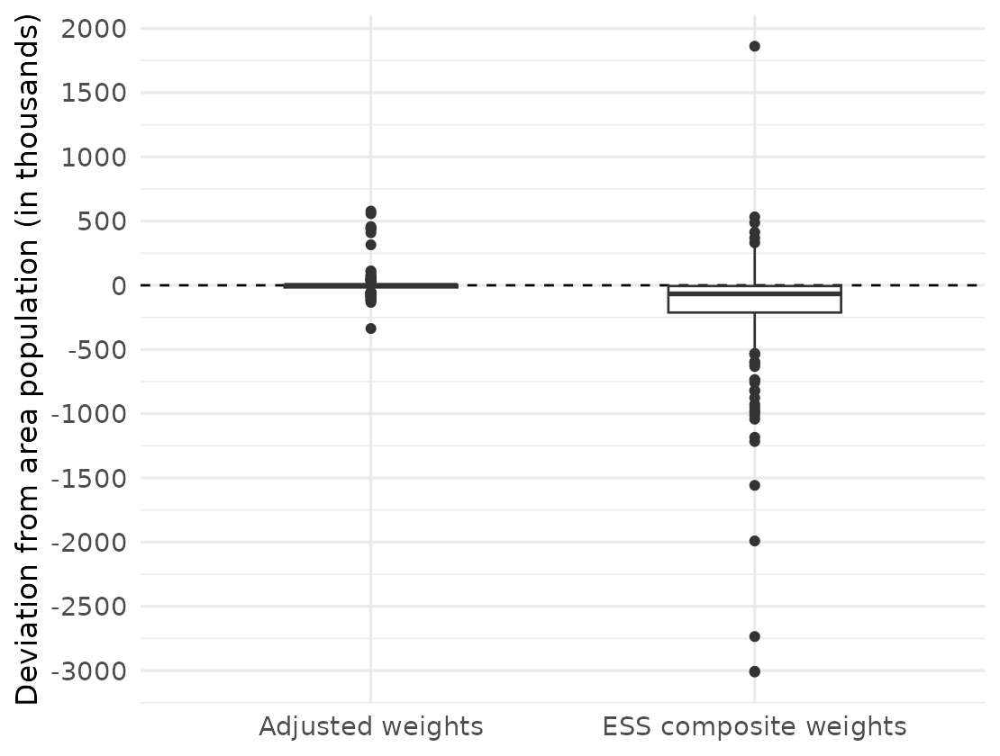
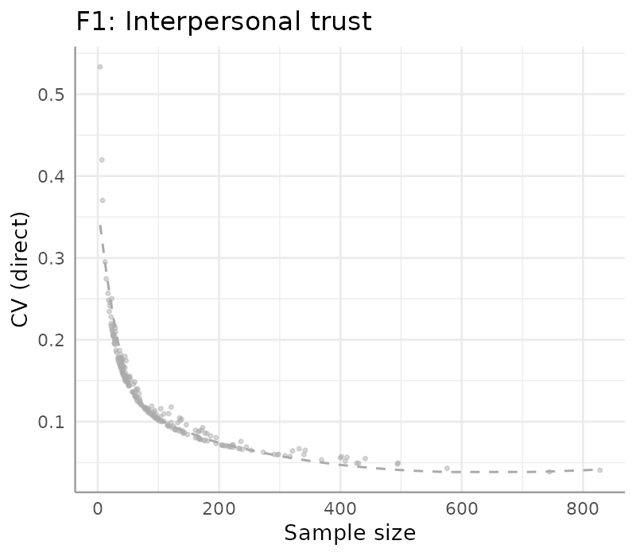
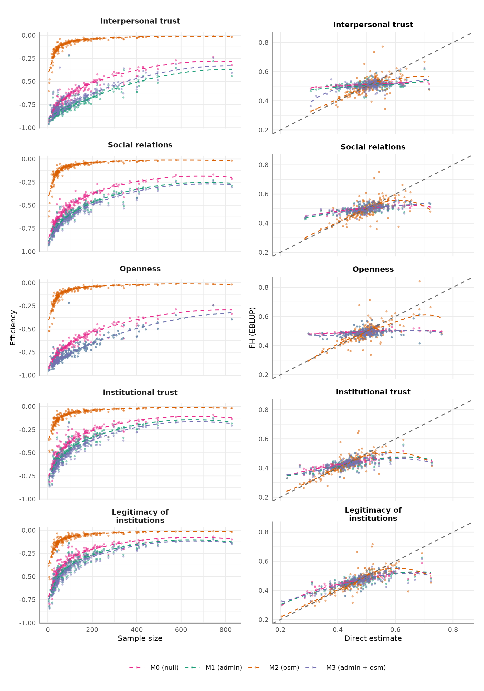
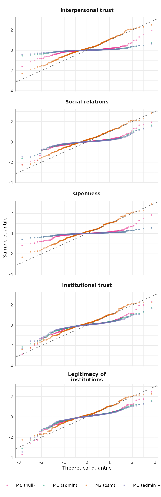
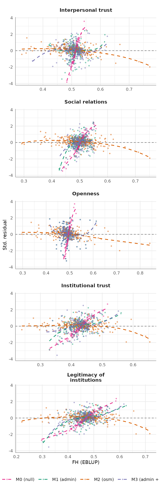
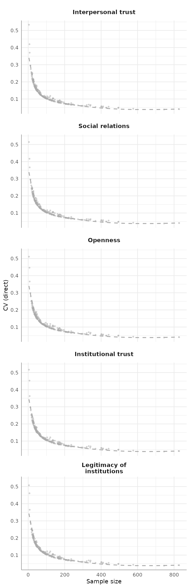

\newpage

\pagenumbering{arabic}

\tableofcontents

\newpage

```{r}
#| label: setup
#| include: false

knitr::opts_chunk$set(fig.align = "center")

library(tidyverse)
library(kableExtra)

```

## 1 Introduction {#sec-intro}

In the political, public and academic debate, social cohesion is commonly regarded as a feature that always seems to be currently deteriorating. The origins of the concept of social cohesion can be traced back to classical sociological research, which sought to understand the 'social glue' holding modern societies together [@durkheim2018]. Contemporary research on social cohesion has largely moved away from general sociological theory, but has not arrived at a universally accepted definition yet [@schiefer2016]. @chan2006a identify two main strands in the discussion within social cohesion research: an analytical socio-psychological approach, and a policy-oriented approach. Policy-oriented research mainly focuses on measurement models of social cohesion, where social cohesion is typically defined as a latent, not directly measurable, property of populations consisting of multiple dimensions [@chan2006a]. <!--# DON'T NEED THEM BECAUSE THEY ARE ALL MENTIONED IN CHAN (@jenson1998mapping; @duhaime2004; @berger-schmitt2002; @noll2002; @rajulton2006; @bollen1990; @whelan2005; @chan2006a) -->

This policy-oriented strand reflects the demand in measurement instruments of social cohesion to inform policy interventions. For instance, European Union Cohesion Policy aims to reduce economic, social, and territorial disparities between countries and regions in the EU [@EuropeanCommissionCohesionFund]. Beyond this, social cohesion is also part of monitoring frameworks linked to the Sustainable Development Goals (SDG). The Dutch Monitor of Well-being and the SDGs includes a section on SDG 10.1, where social cohesion, inclusiveness, and equality are treated as part of the broader goal of reducing inequalities [@CBS2023SocialCohesionInequality]. At sub-national level, the South Aegean Social Inclusion Observatory in Greece provides an example of a regionally targeted policy initiative funded by the European Social Fund [@EuropeanSocialFundPlus2024SouthAegean]. Importantly, the project itself highlights the need for better regional monitoring, noting that fragmented or insufficient data infrastructure limits the ability to track socioeconomic conditions. This illustrates the importance of regional evidence about social cohesion.

@bottoni2016 proposes and validates a latent multi-level model of social cohesion as a synthesis of multiple contributions in the literature. Their model distinguishes between the collective and individual dimension of the phenomenon, where social cohesion is treated as a collective property of a population, whereas social inclusion is conceptualized as an individual-level attribute. Dimensions of social cohesion used in Bottoni's model are relational in nature, capturing both practical interactions between individuals (social support, participation, density of relations) and attitudinal dispositions towards individuals, institutions or groups (interpersonal and institutional trust, openness towards migration, legitimacy of institutions). Although some dimensions of social cohesion that follow Bottoni's definition, such as interpersonal and institutional trust, have been shown to exhibit spatial variability at the national level [@charron2019measuring]; @dindaroglu2023\], less is known about the spatial distribution of social cohesion at small geographic scales across Europe. Evidence from the Netherlands suggests that certain indicators of social cohesion vary across administrative units [@van2025multilevel]. In European comparison, some dimensions, such as trust, civic participation, and attitudes toward immigration, have been shown to vary spatially within countries [@van2025multilevel; @moretti2024; @czaika2018; @orteca2015investigation], but systematic evidence on the small-scale spatial distribution of social cohesion across Europe remains limited.

Addressing this gap requires methods that can produce reliable estimates at regional level. Being measured at individual level, social cohesion indicators need to be aggregated to regional scale in order to assess the degree of social cohesion across regions. However, survey data is typically not designed for obtaining efficient estimates at a sub-national level. While sample surveys usually suffer from small sample sizes, traditional national enumerations, such as the Census, achieve wide coverage but they are costly and face problems with timeliness. Small area estimation (SAE) offers a methodological tool capable of producing more accurate and precise estimates using survey data. Compared to direct estimates, which are estimates produced using sample observations of the target variable alone, SAE consists of model-based methods that combine survey data with auxiliary information in order to estimate aggregated target parameters, such as means or proportions, for groups or areas where the sample size is small. This is done by ‘borrowing strength’ via incorporating auxiliary information correlated with target estimates [@rao2015]. Compared to direct estimates, SAE typically lowers the mean squared error by leveraging the bias-variance trade-off. This means that model-based estimates may introduce some bias by shrinking unstable direct estimates toward a model-based prediction, but this can be compensated by a reduction in variance of the SAE estimates.

Since social cohesion is multidimensional, consolidating its dimensions is essential: estimates of individual indicators alone do not provide a clear and interpretable picture for the public or for policymakers. To construct composite measures of such latent constructs, several SAE approaches have been proposed. The most natural approach in this thesis is to define an explicit latent variable model according to Bottoni's definition, in which the composite measure is represented by predicted factor scores. This approach has been previously used in the context of SAE and is discussed in more detail in [@moretti2019].

Geographic big data can potentially help explaining spatial variability in outcomes modeled through small area estimation by offering high-resolution geo-referenced data of built and natural environment. OpenStreetMap (OSM) represents one of the most prominent of these sources. Although some studies highlight its potential for official statistics [@salvucci2021, @ninivaggi2023; @balducci2019], its use as auxiliary information in SAE remains unexplored. OSM offers a variety of data, including buildings, land use and road infrastructure [@mooney2010], that is produced in different ways: by using GPS digitizing areal imagery, or AI-assisted image processing and tagging [@neis2012; @fila2025]. OSM’s data quality and completeness have been subject of extensive investigation. In terms of coverage, regions with higher building density are better covered, meaning that urban areas better represented in OSM [@zhou2017]. But there are differences: urban areas which are located in Europe, are economically better off and more urbanized have the highest building completeness [@herfort2023]. As sub-national economic segregation tends to be more persistent than the segregation on national level in the EU [@komarova2021], this implies varying data quality across sub-national units. In addition, there is evidence of spatial autocorrelation in mapping, activity in OSM being a function of proximity to more complete [@herfort2023] and more dense [@jokararsanjani2014] areas. Despite these issues, geographic big data from OSM potentially suits the purpose of producing small area estimates of social cohesion in Europe. While there is variation in data quality due to the rural-urban divide and economic segregation between and within European countries, Europe is well represented in OSM. Least represented areas are expected to be rural areas on the economic periphery of Europe. This means that estimates for these areas based on OSM data will be less reliable reproducing the problem of rural areas being traditionally less studied in terms of social cohesion. Nonetheless, the growing coverage and accessibility of OSM data makes it worthwhile to investigate its potential as auxiliary information in SAE models of social indicators.

Against this background, the question arises: To what extent can small area estimates of social cohesion at the sub-national level in Europe be improved by the use of OpenStreetMap? This thesis is organized as follows. Section 2 reviews the literature on the immediate residential environment as a determinant of social cohesion, with the aim of identifying suitable covariates for the small-area estimation models from administrative statistics and OSM. Section 3 provides an overview of the data sources and variables used in the analysis. Section 4 then describes the methodological approach, and in section 5 the findings are presented and discussed. The conclusion follows in section 6.

## 2 Theoretical background {#sec-theory}

Social cohesion emerges from everyday interactions embedded in specific places. The local environment, understood here as the immediate residential context in which individuals live, can shape multiple aspects of social cohesion. Following Bottoni’s conceptualization, these aspects include relations between individuals, relations between individuals and social groups, and relations between individuals and institutions. A local perspective is therefore essential for identifying and explaining regional variation in social cohesion and for deriving suitable predictors for small area estimation models.

One way in which the local environment may affect social cohesion is by shaping opportunities for interpersonal interaction. @small2019 introduces the concept of spatial composition to describe how the physical elements of a place structure the conditions under which social interaction becomes more or less likely. These elements can serve as locations where residents encounter one another and potentially form social ties. However, not all places contribute equally to social relations. Places that function as intentional gathering spaces can act as foci around which people organize their interactions and thereby form interpersonal ties and clusters of social connections [@feld1981]. By contrast, spaces that bring people together only through mere co-presence, without supporting shared activities or a sense of collective identity, may have limited effects on social cohesion among residents [@wickes2018]. From this perspective, characteristics of the built environment that indicate the presence, accessibility, or density of such interaction spaces are relevant predictors for dimensions of social cohesion related to interpersonal ties, support, and participation.

The local environment may also influence relations between individuals and social groups by shaping opportunities for contact across social boundaries. Social infrastructure, including spaces such as libraries, parks, educational institutions, and community centers, is commonly understood as infrastructure that provides networking spaces and can thereby facilitate interpersonal trust [@joshi2025]. Such settings may also support positive relations between different social groups [@allport1954nature]. In addition, areas with greater availability of social infrastructure may expose residents to a broader range of potentially heterogeneous social contacts [@heine2025]. At the same time, this potential depends on how access to these spaces is distributed. Persistent inequalities in access to amenities driven by social segregation across space [@michelangeli2025] may limit opportunities for cross-group encounters. Moreover, some types of social infrastructure may reproduce social segregation by reinforcing interactions among similar groups rather than fostering diversity [@fraser2024a]. These mechanisms suggest that local indicators of amenity provision, accessibility, and their position in space might be relevant for explaining dimensions of social cohesion related to openness, inclusion, and relations between social groups.

Finally, the local environment can shape relations between individuals and institutions. The quality of local infrastructure influences how residents evaluate public institutions and the extent to which they perceive them as responsive to local needs. When residents are satisfied with amenities and services in their residential area, they tend to express higher trust in local authorities, which may also serve as a foundation for more general public trust [@fitzgerald2014]. Conversely, perceptions of deteriorating or unequal service provision can erode institutional trust. This is visible, for example, in widening urban–rural divides, where rural residents increasingly perceive their socio-economic infrastructure as lagging behind that of urban centers [@mitsch2021]. Community embeddedness may further strengthen institutional trust, as individuals who feel integrated into local networks and trust those around them are more likely to extend trust toward public institutions [@putnam1994]. Local institutional performance may also affect social cohesion indirectly through residential stability: dissatisfaction with local amenities can encourage people to move elsewhere [@dustmann2014], potentially weakening long-term community ties.

The reviewed literature therefore suggests that the immediate residential environment is linked to several dimensions of social cohesion identified in Bottoni’s framework. Translating these theoretical mechanisms into the empirical analysis requires selecting indicators that are both conceptually meaningful and available in the OSM data. Among the available OSM features, certain amenities appear particularly suitable for approximating local opportunity structures, as they indicate places where residents may encounter one another, access essential services, and come into contact with public or semi-public institutions.

Educational amenities, such as universities or schools, may serve not only as everyday meeting places, but also as sites of institutional embeddedness. Similarly, healthcare and social-service amenities may reflect access to essential services and local welfare infrastructure. Cultural and social gathering places, including community centers and marketplaces, capture spaces in which interpersonal and group-based interaction can take place. In addition, basic facilities and other public or semi-public amenities, such as places of worship, internet cafés, and collective kitchens, point to shared local resources that may support everyday forms of contact, assistance, and community life. Moreover, places such as refugee may indicate local contexts in which relations between different social groups, and questions of inclusion and openness, become particularly salient. These amenity categories thus capture different aspects of the local environment through which interpersonal relations, relations between social groups, and institutional trust may be shaped. They provide the theoretical basis for selecting the available OSM-based predictors in the small area estimation models used in this thesis.

Administrative variables can complement OSM data by capturing broader regional background conditions. This follows a common practice in small area estimation, where model-based estimates rely on auxiliary information available at the small-area level, often from census data, registers, or administrative records, to improve estimates for areas with limited survey information [@Erciulescu2021AdminSAE] and often cover regional properties such as demographic composition, settlement structure, education, socio-economic conditions, labour-market integration, and public safety.

## 3 Data {#sec-data}

### 3.1 Survey data {#sec-data-survey}

#### 3.1.1 The European Social Survey {#sec-data-survey-ess}

For measuring social cohesion, the operationalization is based on the latent model proposed by @bottoni2016. The model was originally validated using indicators from the European Social Survey (ESS) Round 6 (2012). The ESS is a biennial, cross-national survey designed to measure attitudes, beliefs, and behavioral patterns across European societies through the use of standardized questionnaires. The survey employs cross-sectional probability sampling of all persons aged between 15 and 99 years residing in private households within each participating country, but the specific sampling designs differ across countries. The ESS therefore provides design weights that account for the selection probabilities of sampled units under the respective national sampling designs. The use and adjustment of these weights for the regional direct estimates is described in Chapter 4.3.

In ESS, the data is geo-referenced through Nomenclature of Territorial Units for Statistics (NUTS). NUTS is a hierarchical geocode standard used to subdivide EU member states and associated countries into comparable territorial units for statistical reporting, regional analysis, and the implementation of regional policies and funding programmes. The number attached to the NUTS level indicates the degree of spatial aggregation: the higher the NUTS level, the smaller the territorial unit. For example, in the Netherlands, NUTS 1 regions correspond to broad macro-regions such as West-Nederland or Zuid-Nederland. These are subdivided into NUTS 2 regions, which largely correspond to provinces, such as Noord-Holland, Zuid-Holland, or Noord-Brabant. NUTS 3 regions are smaller statistical regions within provinces, such as Groot-Amsterdam or Zuidoost-Noord-Brabant. The available NUTS level differs across ESS countries due to country-specific data protection and confidentiality restrictions. @tbl-avlbl-nuts lists the NUTS level available for each country included in the analysis.

```{r}
#| echo: false
#| message: false
#| warning: false
#| label: tbl-avlbl-nuts
#| tbl-cap: "Available NUTS levels for respondents’ place of residence by country in ESS 11"

nuts_level_table <- data.frame(
  `NUTS level` = c(
    "NUTS 1",
    "NUTS 2",
    "NUTS 3"
  ),
  `ESS country (country code)` = c(
    "Germany (DE), Italy (IT)",
    "Austria (AT), Belgium (BE), France (FR), Greece (EL), Netherlands (NL), Norway (NO), Poland (PL), Portugal (PT), Spain (ES), Sweden (SE), Switzerland (CH)",
    "Bulgaria (BG), Croatia (HR), Finland (FI), Hungary (HU), Ireland (IE), Slovenia (SI)"
  ),
  check.names = FALSE
)

knitr::kable(
  nuts_level_table,
  booktabs = TRUE,
  format = "latex"
) %>%
  kableExtra::kable_styling(
    font_size = 9,
    latex_options = c("hold_position")
  ) %>%
  kableExtra::row_spec(0, bold = TRUE) %>%
  kableExtra::column_spec(1, width = "4cm") %>%
  kableExtra::column_spec(2, width = "11cm")


```

Country coverage varies across ESS waves, and the ESS includes both EU and non-EU countries. Since the analysis relies on NUTS regions as spatial units, only countries with an available NUTS classification are included. This retains EU Member States and Norway, while Israel, Ukraine, and the United Kingdom are excluded. Further exclusions were necessary where the administrative covariates used in the small area models were unavailable. This affected Cyprus, Montenegro, Latvia, Serbia, Iceland, Lithuania, Slovakia, and parts of Portugal. The final dataset therefore reflects a compromise between geographic coverage and the availability of auxiliary variables. After these exclusions, the final dataset includes 233 regions.

The ESS is designed primarily for cross-national comparisons rather than regional estimation. As a result, regional sample sizes and sampling fractions are often small, and direct estimates below the national level may be unstable. @tbl-sample reports summary statistics for the area-level sample sizes and sampling fractions used in this study.

```{r}
#| echo: false
#| message: false
#| warning: false
#| label: tbl-sample
#| tbl-cap: "Summary statistics of area-level sample sizes and sampling fractions"

library(tidyverse)

sampling_summary <- readRDS(file.path("03_output", "tables", "descriptives", "sampling_summary_table.rds"))


knitr::kable(
  sampling_summary,
  booktabs = TRUE,
  format = "latex"
) %>%
  kableExtra::kable_styling(
    font_size = 9,
    latex_options = c("hold_position")
  ) %>%
  kableExtra::row_spec(0, bold = TRUE) %>%
  kableExtra::column_spec(1, width = "4cm") %>%
  kableExtra::column_spec(2:7, width = "1.5cm") %>%
  kableExtra::footnote(
    general = c(
      "The sampling fraction is defined as the ratio of the sample size to the population size in an area.",
      "The total number of areas is D = 233."
      ),
    general_title = "Note:")

```

#### 3.1.2 Variables {#sec-data-survey-vars}

Bottoni’s original framework includes seven dimensions of social cohesion, but this thesis models only five due to data limitations in ESS Round 11 (2023). The dimensions of social support and participation are excluded because the corresponding indicators are unavailable. Using earlier ESS rounds would allow their inclusion but would require outdated and incomplete OSM data. The selected approach prioritizes consistency with current, higher-quality OSM information. The dimensions and the indicators are displayed in @tbl-dim-ind.

```{r}
#| echo: false
#| message: false
#| warning: false
#| label: tbl-dim-ind
#| tbl-cap: "ESS round 11 questions measuring five dimensions of social cohesion"

indicators_df <- data.frame(
  Dimension = c(
    c("1. Interpersonal trust", rep("", 2)),
    c("2. Density of social relations", rep("", 2)),
    c("3. Openness", rep("", 2)),
    c("4. Institutional trust", rep("", 3)),
    c("5. Legitimacy of institutions", rep("", 3))
  ),
  Indicator = c(
    "1. Most people can be trusted or you can’t be too careful",
    "2. Most people try to take advantage of you, or try to be fair",
    "3. Most of the time people helpful or mostly looking out for themselves",
    
    "4. How often socially meet with friends, relatives or colleagues",
    "5. How many people with whom you can discuss intimate and personal matters",
    "6. Take part in social activities compared to others of same age",
    
    "7. Immigration bad or good for country’s economy",
    "8. Country’s cultural life undermined or enriched by immigrants",
    "9. Immigrants make country worse or better place to live",
    
    "10. Trust in country’s parliament",
    "11. Trust in the legal system",
    "12. Trust in politicians",
    "13. Trust in political parties",
    
    "14. How satisfied with the national government",
    "15. How satisfied with the way democracy works in country",
    "16. State of education in country nowadays",
    "17. State of health services in country nowadays"
  ),
  Measurement = c(
    "0 = You can't be too careful; 10 = Most people can be trusted",
    "0 = Most people try to take advantage of me; 10 = Most people try to be fair",
    "0 = People mostly look out for themselves; 10 = People mostly try to be helpful",
    
    "1 = Never; 2 = Less than once a month; 3 = Once a month; 4 = Several times a month; 5 = Once a week; 6 = Several times a week; 7 = Every day",
    "0 = None; 1 = 1; 2 = 2; 3 = 3; 4 = 4–6; 5 = 7–9; 6 = 10 or more",
    "1 = Much less than most; 2 = Less than most; 3 = About the same; 4 = More than most; 5 = Much more than most",
    
    "0 = Bad for the economy; 10 = Good for the economy",
    "0 = Cultural life undermined; 10 = Cultural life enriched",
    "0 = Worse place to live; 10 = Better place to live",
    
    "0 = No trust at all; 10 = Complete trust",
    "0 = No trust at all; 10 = Complete trust",
    "0 = No trust at all; 10 = Complete trust",
    "0 = No trust at all; 10 = Complete trust",
    
    "0 = Extremely dissatisfied; 10 = Extremely satisfied",
    "0 = Extremely dissatisfied; 10 = Extremely satisfied",
    "0 = Extremely bad; 10 = Extremely good",
    "0 = Extremely bad; 10 = Extremely good"
  ),
  Variable = c(
  "ppltrst", "pplfair", "pplhlp", # interpersonal trust
  "sclmeet", "inprdsc", "sclact", # social relations
  "imbgeco", "imueclt", "imwbcnt", # openness
  "trstprl", "trstlgl", "trstplt", "trstprt", # institutional trust
  "stfgov", "stfdem", "stfedu", "stfhlth" # legitimacy institutions 
  )
)

knitr::kable(
  indicators_df,
  booktabs = TRUE,
  format = "latex"
) %>%
  kableExtra::kable_styling(
    font_size = 9,
    latex_options = c("hold_position")
  ) %>%
  kableExtra::row_spec(0, bold = TRUE) %>%
  kableExtra::column_spec(1, width = "3cm") %>%
  kableExtra::column_spec(2, width = "6cm") %>%
  kableExtra::column_spec(3, width = "4cm") %>%
  kableExtra::column_spec(4, width = "1.5cm")


```

```{r}
#| echo: false
#| message: false
#| warning: false 
#| label: tbl-desc-ess
#| tbl-cap: "Descriptive statistics of observed ESS indicators by social cohesion dimension"

item_summary <- readRDS(file.path(
  "03_output", "tables", "descriptives", "data_table_summary_indicator_items.rds"))

# show dimension name only once per block
item_summary_display <- item_summary %>%
  group_by(Dimension) %>%
  mutate(
    Dimension = if_else(row_number() == 1, Dimension, "")
  ) %>%
  ungroup()

knitr::kable(
  item_summary_display,
  booktabs = TRUE,
  format = "latex"
) %>%
  kableExtra::kable_styling(
    font_size = 9,
    latex_options = c("hold_position")
  ) %>%
  kableExtra::row_spec(0, bold = TRUE) %>%
  kableExtra::column_spec(1, width = "3cm") %>%
  kableExtra::column_spec(2, width = "3cm") %>%
  kableExtra::column_spec(3, width = "2cm") %>%
  kableExtra::column_spec(4:8, width = "1cm") %>%
  kableExtra::footnote(
    general = c(
      "The total number of individual observations is n=38271"),
    general_title = "Note:")
```

@tbl-desc-ess presents descriptive statistics for the observed ESS indicators used in the latent social cohesion model. Overall, all indicators cover their full response range. Since the items are measured on different scales, dispersion is mainly comparable within scale types. Among the 0–10 indicators, standard deviations range from about 2.2 to 2.6, suggesting considerable heterogeneity around the mean. Starting with interpersonal trust, the three indicators are centered around the middle of the scale, with perceived fairness scoring slightly higher than general trust and perceived helpfulness. The middle 50% of responses mostly fall between 4 and 7, indicating moderate but heterogeneous levels of interpersonal trust. Turning to density of social relations, the indicators suggest relatively frequent social contact: the median response corresponds to weekly meetings, while the typical number of close discussion partners is around three. On average, respondents describe their participation in social activities as about the same as others of their age. The indicators for openness towards migration likewise show average values close to the midpoint of the scale. Here, the cultural item stands out with the highest mean in this dimension (5.42). Finally, the institutional indicators show the clearest internal contrast. Within institutional trust, trust in the legal system is relatively high, whereas the parliament is trsuted less, and the lowest scores can be attributed to the trust in politicians and political parties. Similarly, within legitimacy of institutions, satisfaction with the national government is the lowest item, while satisfaction with democracy and evaluations of education and health services are closer to the scale midpoint. Overall, evaluations of political actors and government performance are less favorable than evaluations of legal and welfare-state institutions.

### 3.2 Auxiliary data {#sec-aux-data}

#### 3.2.1 Administrative data {#sec-aux-data-admin}

Administrative variables are obtained from datasets in Eurostat database. These sources provide comparable regional statistics for NUTS regions and are used as auxiliary information in the small area models. Not all administrative variables were available at the lowest regional level used in the ESS data. Where variables were only available at NUTS 2 level, the same value was assigned to all NUTS 3 regions contained within the corresponding NUTS 2 region. For NUTS 1 regions, values were aggregated to the respective higher-level region where necessary. Most variables refer to 2023. For police-recorded offences, data from 2022 and 2023 were combined, as complete 2023 information was not available for all countries. This procedure increases regional coverage but implies that some auxiliary variables contain less spatial detail than others. The complete least of the datasets and variables used is provided in the Appendix F.

Descriptive statistics for the administrative variables used in the analysis are displayed in @tbl-desc-admin. Population density is highly right-skewed, with a median of 79.44 inhabitants per km² but a maximum of 7,735.67, reflecting the inclusion of both sparsely populated and highly urbanized regions. Demographic variables show relatively low variation. The female population share is balanced, as expected, with only minor differences across regions. Age structure varies somewhat more, with the largest differences observed for the population aged 60–79. Greater regional differences are observed for education, poverty, and employment indicators. The share of individuals at risk of poverty or social exclusion varies strongly, ranging from 8.90% to 39.30%. Employment rates also differ substantially across regions, although the distributions are similar for both age groups considered. Police-recorded offences also show pronounced regional heterogeneity. Theft is substantially more common than robbery, with a mean of 21.45 recorded thefts per 10,000 inhabitants compared to 0.43 recorded robberies per 10,000 inhabitants.

```{r}
#| echo: false
#| message: false
#| warning: false
#| label: tbl-desc-admin
#| tbl-cap: "Descriptive statistics of administrative variables used as auxiliary information"

admin_summary <- readRDS(file.path(
  "03_output", "tables", "descriptives", "table_summary_admin.rds"))

knitr::kable(
  admin_summary,
  booktabs = TRUE,
  format = "latex"
) %>%
  kableExtra::kable_styling(
    font_size = 9,
    latex_options = c("hold_position")
  ) %>%
  kableExtra::row_spec(0, bold = TRUE) %>%
  kableExtra::column_spec(1, width = "5cm") %>%
  kableExtra::column_spec(2, width = "2.5cm") %>%
  kableExtra::column_spec(3:7, width = "1cm") %>%
  kableExtra::footnote(
    general = c(
      "The total number of areas is D = 233."),
    general_title = "Note:")

```

#### 3.2.2 OpenStreetMap data {#sec-aux-data-osm}

OpenStreetMap data can be accessed via the read-only application programming interface Overpass API using the Overpass Query Language (Overpass QL). This API supports filtering by attributes, geometry, and geographic extent. The database is structured around three core elements: nodes (point coordinates), ways (ordered lists of nodes forming lines or areas), and relations (groupings of nodes and ways). Attributes can be understood as properties of these geometrical objects. For instance, an attribute could be a function of a building, or any other specification or description.

Attributes in OSM are stored as tags, which consist of key-value pairs attached to these elements. Tags describe the properties of an object, such as its function, use, or physical characteristics. For example, a school may be represented by the tag `amenity=school`, where `amenity` is the key and `school` is the value. While contributors can create or use tags according to local needs, established tagging conventions are widely documented and are recommended to be followed to ensure consistency and comparability across regions [@OpenStreetMapWikiAnyTagsYouLike]. In this thesis, the selection of OSM features is based on established key-value combinations using the `amenity` key. This key is used to identify facilities and services such as schools, hospitals, libraries, places of worship, and community centers and is therefore suitable for the operationalization of plausible predictors identified in the literature review. The key-value pairs used in the data extraction are listed in @tbl-osm-features. An OSM snapshot dated 01.01.2023 was used to match ESS11, with queries limited to the administrative boundaries of the set of countries that are considered in the analysis.

```{r}
#| echo: false
#| message: false
#| warning: false
#| label: tbl-osm-features
#| tbl-cap: "Key-value pairs of OpenStreetMap features used for Overpass API queries"

osm_tags_table <- data.frame(
  `Type of infrastructure` = c(
    "Education",
    "Healthcare",
    "Cultural/social gathering",
    "Facilities",
    "Other"
  ),
  Key = c(
    "amenity",
    "amenity",
    "amenity",
    "amenity",
    "amenity"
  ),
  Value = c(
    "college, kindergarten, library, school, university",
    "clinic, doctors, hospital, nursing_home, pharmacy, social_facility",
    "community_centre, social_centre, nightclub",
    "give_box, shower",
    "internet_cafe, kitchen, marketplace, place_of_worship, public_bath, refugee_site"
  ),
  check.names = FALSE
)

knitr::kable(
  osm_tags_table,
  booktabs = TRUE,
  format = "latex"
) %>%
  kableExtra::kable_styling(
    font_size = 9,
    latex_options = c("hold_position")
  ) %>%
  kableExtra::row_spec(0, bold = TRUE) %>%
  kableExtra::column_spec(1, width = "4cm") %>%
  kableExtra::column_spec(2, width = "1.5cm") %>%
  kableExtra::column_spec(3:7, width = "9cm")

```

Requests to Overpass API servers are subject to rate limits, timeouts, and server load. Data were collected using the Overpass Turbo browser interface, which allows queries to be executed with lower memory requirements, although at the cost of longer processing time. To avoid server timeouts, queries were split into batches.

To reduce the extraction of irrelevant objects, only ways and relations were requested for most features, corresponding to polylines, polygons, and multipolygons. Nodes were included only for selected features where point geometries were expected to be plausible. This applied to showers and give boxes, as these facilities may reasonably be mapped as point objects rather than as polygons or lines. In addition, to reduce data transmission time the extracted spatial information was minimzed so that only geometric centers (centroids) were requested. The full Overpass QL query, including the output settings and query syntax, is provided in the Appendix A.

@tbl-desc-osm summarizes the distribution of the extracted OSM amenity variables. The frequency of amenities varies substantially by type. On average, places of worship are by far the most common feature, followed by schools and kindergartens. These three amenities are observed in all areas. In contrast, give boxes, internet cafés, kitchens, and refugee sites are rarely observed and have the highest number of areas with zero counts. Overall, the OSM variables show distributions typical of count data: most amenities have low values in the majority of areas, while a small number of areas exhibit considerably higher counts. Places of worship are an exception, as their distribution is less sparse and more evenly spread across regions.

```{r}
#| echo: false
#| message: false
#| warning: false
#| label: tbl-desc-osm
#| tbl-cap: "Descriptive statistics of OSM variables used as auxiliary information"

osm_summary <- readRDS(file.path(
  "03_output", "tables", "descriptives", "table_summary_osm.rds"))

knitr::kable(
  osm_summary,
  col.names = c(
    names(osm_summary)[-ncol(osm_summary)],
    "0 counts"
  ),
  booktabs = TRUE,
  format = "latex"
) %>%
  kableExtra::kable_styling(
    font_size = 9,
    latex_options = c("hold_position")
  ) %>%
  kableExtra::row_spec(0, bold = TRUE) %>%
  kableExtra::column_spec(1, width = "1.5cm") %>%
  kableExtra::column_spec(2:3, width = "2cm") %>%
  kableExtra::column_spec(4:8, width = "1cm") %>%
  kableExtra::column_spec(9, width = "1.5cm") %>%
  kableExtra::footnote(
    general = c(
      "The total number of areas is D = 233.",
      "The last column '0 counts' refers to the number of areas containing any of the amenities"),
    general_title = "Note:")

```

In this thesis, zero counts are treated as informative values rather than missing data. This is because it is plausible for certain areas not to contain specific types of facilities, especially rare amenities such as refugee sites, give boxes, or internet cafés. However, zero counts should still be interpreted with caution. As discussed above, OSM data completeness is not uniform across space and mapping activity tends to be spatially clustered in densely populated areas [@jokararsanjani2014]. Consequently, amenities located in more peripheral regions may be less likely to appear in the data, even if they exist in reality. In addition, measurement error may vary by type of amenity. Some facilities are more visible, permanent, and commonly recognized, such as schools, hospitals, or places of worship. Others may be more temporary, less visible, or less consistently considered relevant for mapping. This is important because OSM good-practice guidelines discourage the mapping of temporary features [@OpenStreetMapWikiGoodPractice]. Amenities such as give boxes or refugee sites may therefore be more prone to systematic underrepresentation, either because they are less stable over time, less visible in the built environment, or more sensitive to document publicly. Therefore, zero counts of amenities should be considered as the observed absence of a corresponding OSM object, rather than definitive evidence that the facility is absent in reality. This distinction is important because measurement error in auxiliary data can worsen the performance of small area estimators [@YbarraLohr2008]. While explicitly accounting for the measurement error would be an important extension, it lies beyond the scope of this thesis.

@fig-desc-aux-osm illustrates the spatial distribution of some contrasting examples of OSM amenity variables. The distribution of kindergartens shows relatively little within-country variation. Most regions within the same country fall into similar quantile classes, with Bulgaria and Finland showing somewhat more visible internal heterogeneity. The main pattern is instead between groups of countries. Norway, Sweden, Finland, and Germany tend to have higher counts of kindergartens per 1,000 inhabitants, while Spain, Portugal, France, Italy, and Greece are mostly located in the lower quantiles. Several post-socialist countries, such as Poland, Hungary, Bulgaria, Slovenia, and Croatia, tend to occupy more intermediate positions. This pattern may partly reflect differences in welfare-state arrangements and the organization of childcare provision across Europe [@TkacovaGavurovaToth2024].

{#fig-desc-aux-osm}

Give boxes provide a contrasting example. Here, very little spatial variation is observed, and most regions have zero or very low values. Mapped give boxes are mainly concentrated in Germany and France, with a few additional occurrences in parts of Sweden and Poland. This pattern is likely affected by OSM mapping practices. The fact that they are mainly visible in countries with high OSM contributor activity, such as Germany and France [@NeisOSMstatsCountries] suggests that this variable may rather capture mapping intensity rather than the underlying distribution of the amenity.

The variable measuring doctors per 1,000 inhabitants captures amenities such as doctors’ offices or individual physician practices. Its spatial distribution again shows stronger between-country than within-country differences, although some regional variation is also visible. Low values in Scandinavian countries and Spain should not necessarily be interpreted as weaker healthcare infrastructure. Rather, they may reflect differences in how healthcare services are organized and mapped in OSM. In these countries, clinics appear to be more common than individual doctors’ offices, whereas countries such as France, Germany, the Netherlands, and Poland show relatively more mapped doctors’ offices and fewer clinics. Italy, by contrast, has lower values for both doctors’ offices and clinics, while hospitals are more common and closer to the European average (see supplementary materials for the maps of clinics and hospitals). This example illustrates that OSM categories are not always directly comparable across countries, because similar type of amenity function may be represented through different amenity tags.

Universities, however, show a different pattern, with stronger regional variation within countries. This is plausible, as universities are often concentrated in larger cities and regional centers. This makes the university variable more sensitive to urban-rural differences and the position of regions within national higher-education systems.

## 4 Methods {#sec-methods}

### 4.1 Estimating local cohesion on regional level {#sec-methods-design}

This study aims to estimate social cohesion at the regional level and to compare the contribution of different sources of auxiliary information. To this end, latent variable modeling and small area estimation techniques are employed.

The analysis is conducted in two main steps. First, a multilevel confirmatory factor analysis (MCFA) model is estimated according to the specification in @tbl-dim-ind, using NUTS regions as clustering units. Individual-level factor scores are then predicted for each latent construct. These factor scores provide measures of social cohesion at the individual level (social inclusion), and serve as inputs for both direct estimator and small area estimation via a model-based approach. In the second step, small area models are estimated in three specifications, differing in the source of auxiliary information: (M1) administrative data, (M2) OpenStreetMap data, and (M3) a combination of both. Model selection is carried out using a stepwise procedure based on the KICb2 information criterion, as implemented in the *emdi* R package [@Kreutzmann2019emdi]. The performance of the models is then evaluated and small area estimates are validated against values reported in the literature. The evaluation approach is described in more detail in Chapter 4.4.

The estimation of the MCFA model and the prediction of the factor scores are performed in *Mplus*, Version 8.11. For direct estimation the R package *sae* (Version 1.3) is used, whereas SAE modeling and is carried out using the R package *emdi* (Version 2.2.3).

### 4.2 Multilevel Confirmatory Factor Analysis {#sec-methods-mcfa}

Factor analysis (FA) comprises a class of multivariate techniques used to represent relationships among observed variables (indicators) in terms of latent variables (factors). Confirmatory factor analysis (CFA) tests a prespecified factor structure based on theoretical considerations. Multilevel confirmatory factor analysis (MCFA) extends this framework by decomposing the variance of the indicators into within- and between-cluster components, allowing latent structures to be modeled separately at different levels, such as the individual and regional level.

*Two-level MCFA*

A two-level MCFA model is specified through separate within- and between-level components. At the within-level, the model is given by

\begin{equation}
y_{ijk} = \alpha_{jk} + \lambda_{Wk} \eta_{Wij} + \epsilon_{Wijk},
\end{equation}

where $y_{ijk}$ denotes the observed value of respondent $i = 1, ..., N$ in region $j=1,...,D$ on indicator $k=1,...,K$. Here, $\alpha_{jk}$ is the intercept of indicator $k$ in region $j$, $\lambda_{Wk}$ is the within-level factor loading $\lambda_{W}$ of indicator variable $k$. $\eta_{Wij}$ is the score of the respondent $i$ in region $j$ on the within-level latent factor, and $\epsilon_{Wijk}$ is the within-level residual. At the between-level, the model is specified as:

\begin{equation}
\alpha_{jk} = \nu_{k} + \lambda_{Bk} \eta_{Bj} + \epsilon_{Bjk},
\end{equation}

where $\nu_{k}$ denotes the grand (cross-region) intercept of indicator $k$, $\lambda_{Bk}$ is the between-level factor loading of indicator variable $k$, $\eta_{Bj}$ is the score of region $j$ on the between-level latent factor, and $\epsilon_{Bjk}$ is the between-level error term, also referred to as random intercept in multilevel analysis. The within and between components of the model are connected via the intercept $a_{jk}$, which acts as a latent random variable. Its variability is explained by the between-level factor $\eta_{Bj}$, while any remaining variance is captured by the between–level residual $\epsilon_{Bjk}$.

In matrix notation, MCFA can be expressed through its variance structure. The total covariance matrix of the observed indicators is decomposed into within- and between-level components:

\begin{align}
V(y_{gi}) &= \Sigma_{B} + \Sigma_{W}, \\
\Sigma_{B} &= \Lambda_{B} \Psi_{B} \Lambda_{B}^{T} + \Theta_{B}, \\
\Sigma_{W} &= \Lambda_{W} \Psi_{W} \Lambda_{W}^{T} + \Theta_{W},
\end{align}

where $\Sigma_{W}$ and $\Sigma_{B}$ are the modeled covariance matrices, $\Lambda_{W}$ and $\Lambda_{B}$ are the matrices of factor loadings, $\Psi_{W}$ and $\Psi_{B}$ are the factor covariance matrices, while $\Theta_W$ and $\Theta_{B}$ the covariance matrices of the residuals. For the present model, all indicators are treated as continuous and residual covariance matrices $\Theta$ are estimated directly from the data.

*Prediction of factor scores*

Once a measurement model is determined, factor scores can be computed for both within- and between-level latent factors. For within-level factors with continuous indicators, factor scores can be estimated using the regression method (@thomson1935; @thurstone1935), which corresponds to the posterior mean of the latent factor given the observed data. The factor scores for an individual $i$ are given by:

\begin{equation}
\hat{F}_{\eta_{i}} = \hat{\Psi} \hat{\Lambda}^{T} (\Sigma(\hat{\Theta}))^{-1} y_{i}^{T},
\end{equation}

where $\hat{\Lambda}$ is the estimated matrix of factor loadings, $\hat{\Psi}$ is the estimated covariance matrix of latent factors, $\Sigma(\hat{\Theta})$ is the estimated covariance matrix of the residuals of observed responses, and $y_{i}$​ is the vector of observed responses for individual $i$.

In MCFA, cluster-level indicators correspond to random intercepts, which are latent variables themselves. Between-level factor scores can be estimated using empirical Bayes methods in combination with full-information ML estimation, with posterior means computed conditional on the model and observed data via numerical integration [@asparouhov2015]. <!--# In the presence of both continuous and categorical indicators, as is the case in the present model, factor scores are likewise obtained as posterior expectations on the latent-response scale.  -->

*Latent model of social cohesion*

This paper uses a partial adaptation of Bottoni’s (2016) framework, which originally included seven indicators and two second-order factors: 'social cohesion' (between-level) and 'social inclusion' (within-level). Due to data limitations, two indicators are omitted, and the model captures only the relationships among the remaining factors. Note, that this thesis does not aim to develop a new indicator of social cohesion. Rather, it applies an existing framework to contemporary data in order to generate factor scores.

@fig-mcfa-daigram illustrates the multi-level CFA model applied to the latent model of social cohesion. At the within-level observed indicators $y_{W_{ij1}}-y_{W_{ij17}}$ load onto the five latent factors $\eta_{W_{ij1}}-\eta_{W_{ij5}}$. At the between level, group intercepts $\alpha_{j1}-\alpha_{j17}$ of the observed indicators load onto five aggregate latent factors $\eta_{B_{j1}}-\eta_{B_{j5}}$.

::: center
{#fig-mcfa-daigram}
:::

### 4.3 Small Area Estimation approach {#sec-methods-sae}

Consider a finite population $U$ with size $N$ divided into $D$ small areas (domains) indexed by $d = 1, \dots, D$, with area sizes $N_d$. The total sample size $n$ is given by $\sum_{d} n_d$, where $n_d$ denotes the sample size in area $d$. Let $\hat{\bar{Y}}_d^{\mathrm{DIR}}$ denote the direct estimator of the population mean $\bar{Y}_d$ for a characteristic of interest in area $d$, based on a random sample $s$ drawn from $U$. In this study, the smallest available NUTS regions are used as small areas. The areas are considered small, because their sample sizes are insufficient to provide reliable evidence at regional level, as discussed in Chapter 3.1.1.

*Direct estimation*

The direct estimator of the population mean in area \$d\$ is defined as the Horvitz--Thompson estimator of the domain mean [@morales2021course, p. 28; @MolinaMarhuenda2015sae]:

\begin{equation}
\hat{\bar{Y}}_d^{\mathrm{DIR}}
=
\frac{1}{N_d}
\sum_{j \in s_d} w_j y_j ,
\end{equation}

where $s_d$ denotes the set of sampled units in area $d$, $w_j$ is the survey weight of unit $j$, $y_j$ is the observed value of the study variable, and $N_d$ is the known population size of area $d$. The corresponding variance estimator [@morales2021course, p. 28] is given by

\begin{equation}
\widehat{\mathrm{Var}}_{\pi}
\left(
\hat{\bar{Y}}_d^{\mathrm{DIR}}
\right)
=
N_d^{-2}
\sum_{j \in s_d}
w_j(w_j - 1)y_j^2 ,
\end{equation}

where $\widehat{\mathrm{Var}}_{\pi}$ denotes the estimated design-based variance under the sampling design.

*Accounting for sampling design in areas*

The direct estimator used in this study is a design-based estimator of the area mean. In design-based estimation, inference is based on the sampling design, and the basic survey weight is the inverse of the first-order inclusion probability.

The ESS provides design weights to correct for unequal inclusion probabilities of sampled units. In addition, population weights are provided to produce estimates at the population level. The composite ESS weight can be obtained by multiplying the design weight and the population weight. Since ESS population weights are scaled to represent population totals in units of 10,000, the product is multiplied by 10,000 to obtain population counts.

\begin{equation}
w_j^{\mathrm{comp}}
=
w_j^{\mathrm{design}}
\cdot
w_j^{\mathrm{pop}}
\cdot
10{,}000,
\end{equation}

Since the target population in this study is defined at the area level, the weights need to scale the sampled units to the population totals of the corresponding NUTS regions. However, the ESS population weights are calibrated to country-level population totals. Therefore, the area-level weights used for direct estimation, denoted by $w_{jd}$, are constructed by rescaling the original ESS design weights within each area:

\begin{equation}
w_{jd}
=
w_j^{\mathrm{design}}
\frac{N_d}{n_d}.
\end{equation}

where $w_j^{\mathrm{design}}$ denotes the original ESS design weight for individual $j$, $N_d$ denotes the target population in area $d$, and $n_d$ is the number of sampled individuals in area $d$. The factor $N_d/n_d$ corresponds to the inverse area-specific sampling fraction. This adjustment preserves the ESS design weights within each area while scaling them to the regional target population.

The adjustment was evaluated by comparing the sum of weights within each area to the corresponding area population. If the adjustment works as intended, the sum of weights within area $d$ should be close to $N_d$. @fig-boxplot-weights shows the distribution of deviations from the true area population for both the original ESS composite weights and the adjusted weights. The comparison shows that deviations are smaller when the adjusted weights are used, indicating that they reproduce the regional population totals more accurately than the original ESS composite weights.

{#fig-boxplot-weights fig-align="center"}

*Fay-Herriot model*

In small area estimation, model-based approaches improve the precision of direct estimators by linking survey estimates to auxiliary information. In this study, the objective is to evaluate OSM predictors as area-level covariates for aggregate estimators. Accordingly, the analysis is conducted at the area level using the Fay and Herriot model [@fay1979]. An alternative are unit‑level (nested‑error) models, which use microdata and individual‑level auxiliaries to model within‑area variation (@battese1988errorcomponents, @mauro2017areaunitmodels); these are not considered here because our goal is to evaluate OSM predictors as area‑level covariates for aggregate estimators, a question that does not require microdata nor change the area‑level assessment.

The univariate Fay and Herriot model is defined in two stages. The sampling model is given by

\begin{equation}
\hat{\bar{Y}}_d^{\mathrm{DIR}} = \bar{Y}_d + e_d, \quad e_d \sim N(0, \sigma_d^2),
\end{equation}

where $e_d$ represents the sampling error, assumed independent across areas, with known variance $\sigma_d^2$. In the second stage, the true area means $\bar{Y}_d$ are related to auxiliary information through a linear mixed model of the form

\begin{equation}
\bar{Y}_d = x_d^\top \beta + u_d, \quad u_d \sim N(0, \sigma_u^2),
\end{equation}

where $x_d$ is a $p \times 1$ vector of auxiliary variables for area $d$, $\beta$ is a $p \times 1$ vector of regression coefficients, and $u_d$ is a random area effect capturing between-area variability. Combining the sampling and linking models yields the Fay-Herriot model:

\begin{equation}
\hat{\bar{Y}}_d^{\mathrm{DIR}} = x_d^\top \beta + u_d + e_d.
\end{equation}

*EBLUP under the Fay-Herriot model*

The Empirical Best Linear Unbiased Predictor (EBLUP) of the small area mean $\bar{Y}_d$ is given by

\begin{equation}
\hat{\bar{Y}}_d^{\mathrm{EBLUP}} = x_d^\top \hat{\beta} + \hat{u}_d,
\end{equation}

where $\hat{\beta}$ and $\hat{\sigma}_u^2$ are estimated using Restricted Maximum Likelihood (REML). Equivalently, the EBLUP can be expressed as a weighted average of the direct and synthetic (model-based) estimators:

\begin{equation}
\hat{\bar{Y}}_d^{\mathrm{EBLUP}} =
\hat{\gamma}_d \hat{\bar{Y}}_d^{\mathrm{DIR}} +
(1 - \hat{\gamma}_d)\, x_d^\top \hat{\beta},
\end{equation}

where

\begin{equation}
\hat{\gamma}_d =
\frac{\hat{\sigma}_u^2}{\hat{\sigma}_u^2 + \sigma_d^2}
\end{equation}

is the shrinkage factor. This formulation shows that the EBLUP shrinks the direct estimator $\hat{\bar{Y}}_d^{\mathrm{DIR}}$ toward the regression-based synthetic estimator $x_d^\top \hat{\beta}$. This reflects a trade-off between the variance of the direct estimator and the bias of the synthetic estimator. The weights depend on the relative magnitudes of $\sigma_d^2$ and $\sigma_u^2$, assigning more weight to the more reliable component in each area. For example, when $n_d$ goes down, $\hat{\gamma}_d$ will give more weight to $x_d^\top \hat{\beta}$ because $\hat{\bar{Y}}_d^{\mathrm{DIR}}$ is less reliable due to its larger sampling variance.

### 4.4 Evaluation approach

Model performance is evaluated on two complementary levels. First, precision is assessed through the relative RMSE of EBLUPs compared to the direct estimator (efficiency, defined as the relative reduction in uncertainty, where more negative is better) and Spearman rank correlations between direct estimates and EBLUPs alongside plots of diagnostics and performance measures by sample size of area units. Second, alignment with the direct survey is assessed: differences between EBLUPs and direct estimates are not interpreted as bias in a strict sense (direct estimates are themselves uncertain, especially in areas with small sample sizes) but as model-induced departures from the observed regional survey pattern; this is operationalized through pairwise distinguishability comparisons as defined below. This distinction matters because a model can reduce uncertainty while at the same time changing the regional ordering or local contrasts in ways that are difficult to interpret substantively. Spatial plausibility of the resulting estimates is additionally compared against external evidence, using M1 (admin) as a sensitivity check on dimensions where auxiliary-data choice materially changes the regional geography.

To make the agreement-vs-precision trade-off concrete in terms of what a substantive researcher would be interested in, two regions $i, j$ are called *distinguishable* under a given specification when $|\hat{\theta}_i - \hat{\theta}_j| > z_{0.975} \cdot \widehat{\mathrm{SE}}(\hat{\theta}_i - \hat{\theta}_j)$. For the direct estimator, $\widehat{\mathrm{SE}} = \sqrt{\hat{\psi}_i + \hat{\psi}_j}$. For the FH estimator, because $\hat{\boldsymbol{\beta}}$ is shared across areas, a cross-covariance correction is applied following @DattaRaoSmith2005:

\begin{equation}
\widehat{\mathrm{SE}}(\hat{\theta}_i - \hat{\theta}_j) = \sqrt{\widehat{\mathrm{MSE}}_i + \widehat{\mathrm{MSE}}_j - 2(1-\hat{\gamma}_i)(1-\hat{\gamma}_j)\,\mathbf{x}_i^\top\widehat{\mathrm{Var}}(\hat{\boldsymbol{\beta}})\,\mathbf{x}_j}.
\end{equation}

A model-implied distinction is *spurious* when it is statistically distinguishable under the model but its sign contradicts the direct estimate; the corresponding *error rate* is the share of model-distinguishable pairs whose sign contradicts the direct survey signal.

## 5 Results and discussion {#sec-results}

### 5.1 Latent model of social cohesion {#sec-results-mcfa}

Before using the factor scores in the direct estimation, the measurement model was estimated in Mplus based on 38,271 observations to obtain individual-level scores for the five dimensions of social cohesion. This section briefly reports the model estimation and the distribution of the resulting factor scores.

During model estimation, the item measuring trust in the legal system was excluded from the institutional trust dimension due to estimation problems in the full multilevel CFA model. The final measurement model was estimated in Mplus using the robust maximum likelihood estimator (MLR) and numerical integration. Because of this estimation setup, conventional global fit indices such as CFI, TLI, RMSEA, and SRMR are not reported by Mplus. Model evaluation is therefore based on successful convergence and the plausibility of the estimated factor scores in light of the observed indicators. The full Mplus output, including all estimated parameters, is provided in the Supplementary Materials.

@tbl-desc-fscores presents descriptive statistics for the scaled factor scores used in the direct estimation. All dimensions were transformed to a common 0–1 scale, where higher values indicate higher levels of the respective dimension of social cohesion. The scaled factor scores summarize the item-level information in a way that preserves the main substantive patterns: interpersonal dimensions tend to score higher, while institutional trust is the weakest dimension. Interpersonal trust has the highest mean score (0.52), closely followed by density of social relations (0.51) and openness towards migration (0.50). Legitimacy of institutions is slightly lower, with a mean of 0.49. Institutional trust clearly records the lowest average value (0.44) and also has the lowest first quartile (0.32), indicating that lower levels of institutional trust are more common in the distribution. Overall, the dimensions show similar dispersion, with standard deviations between 0.13 and 0.16, and the scores cover almost the full 0–1 range across all dimensions.

```{r}
#| echo: false
#| message: false
#| warning: false
#| label: tbl-desc-fscores
#| tbl-cap: "Descriptive statistics of factor scores"

factor_summary <- readRDS(file.path(
  "03_output", "tables", "descriptives", "data_table_summary_factor_scores.rds"))

knitr::kable(
  factor_summary,
  booktabs = TRUE,
  format = "latex"
) %>%
  kableExtra::kable_styling(
    font_size = 9,
    latex_options = c("hold_position")
  ) %>%
  kableExtra::row_spec(0, bold = TRUE) %>%
  kableExtra::column_spec(1, width = "6cm") %>%
  kableExtra::column_spec(2, width = "2cm") %>%
  kableExtra::column_spec(3:7, width = "1cm")

```

### 5.2 Direct estimates {#sec-results-direct}

The area-level direct estimates of the five cohesion dimensions broadly mirror the individual-level factor score distributions described above, but now summarized as regional means across the 233 NUTS areas in the sample (@tbl-res-direct-summ). All five dimensions center near 0.5, and the cross-regional standard deviations are narrow (0.053–0.067), meaning that most of the variation is within regions rather than between them. Institutional trust is again the exception: its cross-regional mean (0.434) sits roughly 0.06–0.07 below the other four dimensions and its minimum (0.224) falls notably lower. The cross-regional range (roughly 0.2 to 0.8 for most dimensions) suggests that genuine geographic variation in social cohesion exists across European NUTS regions, but how much of it can be reliably detected from the direct survey alone is constrained by sampling uncertainty, as discussed below.

The central problem is that sampling uncertainty is of the same order of magnitude as the cross-regional variation itself. The average CV across regions is around 0.13 for all five dimensions; since dimension means are close to 0.5, this corresponds to an average absolute uncertainty of roughly 0.06, nearly identical to the cross-regional standard deviation of 0.053–0.067. The typical uncertainty of a single direct estimate is therefore about as large as the typical difference between regions, meaning that while the largest contrasts, between the most and least cohesive regions, are detectable from the survey alone, the finer within-country differences that are often of substantive and policy interest are not.

For smaller areas the problem is considerably worse: CVs are regularly above 0.2 for regions with fewer than 50 sampled units and reach 0.3 or more in the smallest areas (@fig-cv-direct-by-n-f1), corresponding to absolute uncertainties two to three times the cross-regional SD. The pattern is not shown separately for the other four dimensions because CVs are almost perfectly correlated across regions: sampling precision is driven almost entirely by sample size, which is the same regardless of which cohesion dimension is being estimated. The goal of the small area estimation in the following sections is therefore to improve the precision of these regional estimates while assessing how much of the original survey pattern the model-based estimates preserve.

```{r}
#| echo: false
#| message: false
#| warning: false
#| label: tbl-res-direct-summ
#| tbl-cap: "Descriptive statistics of direct estimates"

direct_summary <- readRDS(file.path(
  "03_output", "tables", "results", "direct_summary.rds"))

direct_summary %>%
  knitr::kable(
  booktabs = TRUE,
  format = "latex"
) %>%
  kableExtra::kable_styling(
    font_size = 8,
    latex_options = c("hold_position")
  ) %>%
  kableExtra::row_spec(0, bold = TRUE) %>%
  kableExtra::column_spec(1, width = "1cm") %>%
  kableExtra::column_spec(2, width = "2cm") %>%
  kableExtra::column_spec(3, width = "1cm") %>%
  kableExtra::column_spec(4:6, width = "3cm") %>%
  kableExtra::footnote(
    general = c(
      "Values: mean (SD), median [min--max];",
      "CV: ceofficient of variation, reported as proportion"))

```

{#fig-cv-direct-by-n-f1}

### 5.3 Model selection and estimator performance

This section compares the performance of the selected Fay–Herriot models across different sources of auxiliary information. Three univariate model specifications are considered for each dimension of social cohesion: M1 includes administrative data only, M2 includes OpenStreetMap data only, and M3 combines administrative and OSM data. For each of the five dimensions, the final specification of M1, M2 and M3 is selected using the stepwise procedure described in the methodology chapter, resulting in 15 fitted models. M0 denotes the corresponding intercept-only model and serves as a shrinkage benchmark.

Two types of metrics are used to evaluate model performance: the improvement in precision of the small area estimates compared to the direct estimates, and the agreement between the model-based estimates and the direct estimates. The latter is not interpreted as bias in a strict sense, since direct estimates are themselves uncertain, especially in areas with small sample sizes. Instead, differences between direct estimates and EBLUPs are used as an indication of model-induced departures from the observed regional survey pattern. This distinction matters because a model can reduce uncertainty while at the same time changing the regional ordering or local contrasts in ways that are difficult to interpret substantively.

Across all model specifications, the relative RMSE of the EBLUPs is lower than that of the direct estimator (@tbl-res-model-summ) . This indicates higher precision of model-assisted estimates and is expected in small area estimation, since the EBLUP reduces sampling variability by shrinking unstable direct estimates toward the model-based synthetic component. The extent of this shrinkage, however, differs strongly across the three specifications.

```{r}
#| echo: false
#| message: false
#| warning: false
#| label: tbl-res-model-summ
#| tbl-cap: "Model performance metrics by dimension and specification"

model_summary_table <- readRDS(file.path(
  "03_output", "tables", "results", "model_summary_table.rds"))

bold_rows <- str_detect(model_summary_table$Metric, "^\\*\\*.*\\*\\*$")

model_summary_table <- model_summary_table %>%
  mutate(Metric = str_remove_all(Metric, "\\*\\*"))

model_summary_table %>%
  knitr::kable(
    booktabs = TRUE,
    format = "latex",
    escape = FALSE
  ) %>%
  kableExtra::kable_styling(
    font_size = 6,
    latex_options = c("hold_position")
  ) %>%
  kableExtra::row_spec(0, bold = TRUE) %>%
  kableExtra::row_spec(which(bold_rows), bold = TRUE) %>%
  kableExtra::column_spec(1, width = "3.5cm") %>%
  kableExtra::column_spec(2:5, width = "2.5cm") %>%
  kableExtra::footnote(
    general = c(
      "Values: mean (SD), median [min--max]; Efficiency = (RMSE_EBLUP - RMSE_Direct) / RMSE_Direct.",
      "Spearman rho = rank correlation between direct estimates and EBLUPs across all NUTS-2 regions.",
      "KICb2 = Kullback information criterion, bias-corrected version 2; lower = better fit.",
      "FH-R2 = 1 - Vu/V0; V0 = between-area variance from the null model; Vu = between-area variance from the covariate-adjusted model.",
      "Negative FH-R2 values can occur when the covariate-adjusted model has a larger between-area variance than the null model."
    )
  )

```

Comparing the three specifications, the OSM-only model (M2) produces estimates with substantially higher uncertainty than the administrative-data model (M1) and the combined model (M3), but stays much closer to the direct estimates. M1 and M3 are very similar to one another in every dimension. The combined model achieves the lowest KICb2 in four of the five dimensions, but the improvement over M1 is small (between 1 and 6 KICb2 units), and the combined specification only adds one to three OSM variables on top of the administrative variables retained by M1. For F3 (openness), the stepwise procedure removed all OSM variables from the combined specification, so M3 reduces exactly to M1. The final specifications of all 15 fitted models are listed in the Appendix B.

The OSM-only model has lower fit than the intercept-only baseline (M0) for all five dimensions (which also leads to a negative FH-R²), meaning that the OSM-only specification underperforms a model that simply shrinks every region toward the European mean. Diagnostic figures in the Appendix C show that, despite this, M2 is the only specification with approximately normal random effects and no striking patterns of heteroscedasticity. M0, M1 and M3, by contrast, show much stronger regression-to-the-mean behaviour driven by their high shrinkage.

The Spearman rank correlations between direct estimates and EBLUPs in @tbl-res-model-summ show the same pattern. M2 preserves the regional ordering of the direct estimator much more closely than M1 or M3 in F1 (0.68 vs 0.29 / 0.31), F2 (0.71 vs 0.55 / 0.56) and F3 (0.73 vs 0.31 / 0.31). For the two institutional dimensions the gap is smaller: F4 (0.78 vs 0.65 / 0.59) and F5 (0.85 vs 0.73 / 0.69); and all three specifications retain the broad survey ordering.

::: centered
{#fig-scatter-eff}
:::

The scatterplots between EBLUP and direct estimate in @fig-scatter-eff also demonstrate a much higher agreement of the OSM-only model with the EBLUPs, they mostly follow the diagonal on average and do not spread around it too much. While the other models systematically estimate higher values for low direct values and lower values for high direct values, for Openness (F3) it is even nearly a flat average prediction that the admin-dominated models and the null model share. This also demonstrates that the null model (M0) might keep ranking intact but with nearly no quantitative difference between values due to the high shrinkage which also generates high efficiency.

Efficiency is the relative change in uncertainty of the EBLUP compared to the direct estimator. Negative values indicate efficiency gains. Across all specifications, gains are largest where direct estimates are weakest (small sample sizes) and shrink as sample size increases (@fig-scatter-eff) For M2, the gain declines quickly: the largest improvements (30–60 %) occur in areas with fewer than \~25 sampled units; for sample sizes between 25 and 200 the typical gain is below 20 %; for areas with more than 200 observations the gain is close to zero and the average efficiency is only slightly higher than 10 % for all outcomes. M1 and M3, by contrast, deliver large efficiency gains across the full sample-size range (40–90 % for F1–F3, 20–85 % for F4–F5) through much heavier shrinkage.

In M2 the weight of the direct estimates is high for all dimensions, so most of the regional survey signal is retained. The closer agreement between OSM-based EBLUPs and direct estimates should therefore not be interpreted as evidence that OSM provides a superior prediction model. It reflects the weaker synthetic component of M2. Conversely, the lower uncertainty of M1 and M3 (and even M0) is achieved through much stronger shrinkage. For the institutional dimensions admin and combined shrink less aggressively, which is consistent with the smaller Spearman gap and with the substantively coherent maps reported below.

### 5.4 Pairwise distinguishable pairs

Table @tbl-res-pairw reports the pooled error rates over all 27,028 within-pool pairs per dimension, together with a within-country / between-country split that separates two analytically different problems: ordering regions within the same country and ordering regions across countries. The distinction is central in the SAE context: country-level surveys are typically designed to support country-level inference, and within-country regional subsamples are often too small for reliable direct estimation, which is precisely the motivation for small area estimation. Within-country pairs are therefore harder to distinguish directly, not only because the regions are often more similar, but because the direct estimates for individual regions within the same country carry large sampling uncertainty. Between-country region pairs are more often statistically distinguishable both because true differences between countries tend to be larger and because the pooled per-country samples support more stable direct estimates at the country level. Note, however, that the "between-country" rows here still count all cross-country *region* pairs (e.g. a region in Bulgaria vs a region in France), not comparisons of country-level means: the unit of analysis remains the individual region throughout. Country-level mean comparisons would typically yield much higher distinguishability rates and are not computed here.

```{r}
#| echo: false
#| message: false
#| warning: false
#| label: tbl-res-pairw
#| tbl-cap: "Pairwise distinguishability and admin/combined sign-error rate against direct survey estimates"

pairwise_within_between_country <- readRDS(file.path(
  "03_output", "tables", "results", "pairwise_within_between_country.rds"))

pairwise_within_between_country %>%
  knitr::kable(
    booktabs = TRUE,
    format = "latex",
    escape = TRUE
  ) %>%
  kableExtra::kable_styling(
    font_size = 6,
    latex_options = c("hold_position")
  )  %>%
  kableExtra::row_spec(0, bold = TRUE) %>%
  kableExtra::column_spec(2:9, width = "1.4cm")

```

Three findings stand out. First, for F1 (interpersonal trust) and F3 (openness), M1 and M3 generate large numbers of FH-distinguishable pairs, roughly five to six times as many as the direct estimator, but about a quarter of these pairs point in a direction opposite to the direct survey signal, both within and between countries. M2 produces only slightly more distinguishable pairs than the direct estimator but almost never reverses its sign (error rate 0–4 %). Second, for F4 (institutional trust) and F5 (legitimacy), all three specifications agree closely with the direct estimator, with sign-error rates below 5 % everywhere; F2 (social relations) sits between these two regimes. Third, the combined model M3 is no improvement over M1 in this respect: it generates more distinguishable pairs at essentially the same error rate as M1, so its small KICb2 advantage is purely a fit-statistic gain that does not translate into improved regional inference. A further implication of M2's low error rate is that where it does resolve a pair the direct estimator cannot, the direction is almost certainly correct: M2 extends rather than overrides the survey signal. The spatial sections below document this pattern for specific within-country contrasts, particularly in Bulgaria, Greece and Hungary.

### 5.5 OSM as a less biased but small efficiency gain?

The main methodological finding is therefore not that OSM improves small area estimation more than administrative data – it does not, in the conventional sense. Administrative data produce much stronger precision gains. The admin model alone is clearly preferred by fit statistics, and the combined model with OSM features added on top is slightly preferred by KICb2, but for the first three dimensions this comes with a sizeable rate of model-induced sign reversals in regional differences against the direct survey signal. The OSM-only specification is much less precise but stays close to the direct estimates and rarely contradicts them.

Since the aim of this study is to evaluate whether OSM can provide useful auxiliary information for small area estimation of social cohesion, precision gains alone are not sufficient. The resulting estimates must also remain substantively plausible at the local level if they are intended to inform regional policy discussion. M2 is therefore used in the following section as the main descriptive specification, not because it is the statistically best-performing model, but because it provides a conservative model-assisted representation of the regional survey pattern. M1 (admin) is used as a sensitivity comparison and shown alongside M2 for the two dimensions where the maps differ materially (F1 and F3); for F2, F4 and F5 the M1 and M3 maps appear in the Appendix D. Where administrative estimates remove local variation or shift regions into different parts of the European distribution in ways that are difficult to reconcile with external evidence, it also indicates that the misalignment of the EBLUPs from the models informed by administrative data might be true bias.

### 5.6 Spatial patterns of social cohesion

This section describes the spatial distribution of the OSM-based small area estimates and compares them with external evidence where possible. The administrative-data maps are used as a sensitivity check to assess whether the stronger precision gains of M1 preserve, attenuate, or reverse substantively plausible spatial patterns. The maps should be read as model-assisted spatial summaries rather than exact rankings of regions: for regions close to quintile boundaries, classification into a particular quintile should be treated cautiously as many estimates are more uncertain than the difference in 1 or sometimes even multiple quintiles. Consistent with the pairwise results above, a recurring theme across all five dimensions is that M2 extends rather than overrides the direct survey: beyond confirming contrasts the survey already resolves, M2 occasionally adds within-country pairwise distinctions that are directionally consistent with the direct estimates but do not reach statistical significance in the raw survey alone. These cases are concentrated where within-country variation is large relative to regional sample sizes, primarily Bulgaria, Greece and Hungary, and are noted throughout the sections below as the clearest instances where model-assisted estimation adds resolution the direct estimates alone cannot provide.

Across the five dimensions, the average OSM-based EBLUPs (over all 233 in-sample regions) are highest for interpersonal trust (F1, mean 0.506), followed by social relations (F2, 0.497), openness towards migration (F3, 0.490), legitimacy of institutions (F5, 0.468), and institutional trust (F4, 0.428) as can be seen in @tbl-res-model-summ. On average, residents thus report higher levels of trust in other people than in political institutions.

#### 5.6.1 Institutional trust and legitimacy of institutions

The two institutional dimensions are measured differently in the underlying scale: institutional trust captures trust in the country’s parliament, legal system, politicians and political parties, while legitimacy of institutions is measured through satisfaction with the national government, the functioning of democracy and the state of education and health services. The estimates indicate that performance-related evaluations (legitimacy) are on average more favourable than confidence in political actors (institutional trust), although both remain below the dimensions reflecting interpersonal relations and intergroup attitudes. Institutional trust also exhibits the smallest range across regions, suggesting a relatively common pattern of cautious assessment of political actors.

::: centered
{#fig-eblup-boxmap-m2-f4}

{#fig-eblup-boxmap-m2-f5}
:::

Institutional trust and legitimacy of institutions display very similar spatial patterns, which is consistent with previous research showing that trustworthiness of institutions is associated with governance performance [@Kiel-Inst-Trust-2023]. Bulgaria (BG), Spain (ES), Croatia (HR) and Greece (EL) are among the countries with the lowest average levels in the institutional dimensions, pointing to weak trust in political institutions and less favourable evaluations of institutional performance. For Bulgaria, 18 of 28 regions fall in the lowest quintile of institutional trust (F4), with a similar share for legitimacy (F5). At the same time, Bulgaria displays pronounced internal variation: Sofia (BG411) reaches the top quintile under M2 with a CI clearly above the European mean, and is pairwise-distinguishable from the bulk of low-scoring Bulgarian regions: pairwise comparisons against Blagoevgrad (BG413), Pazardzhik (BG423) and Veliko Tarnovo (BG321) are significant under both M1 and M2 with no sign reversal. Four further regions, namely three Black Sea coastal regions (Varna BG331, Dobrich BG332, Burgas BG341) and the southern inland region of Haskovo (BG422), also reach the top quintile under M2 and are pairwise-distinguishable from the lowest-scoring Bulgarian regions (Lovech BG315, Sofia oblast BG412); for most of these pairs the contrast is already visible in the direct estimates, with one exception: Dobrich (BG332) vs Sofia oblast (BG412) is non-significant in the direct survey (diff = 0.157, threshold = 0.212) but becomes significant under M2 (diff = 0.201, threshold = 0.163), where the model-based adjustment tightens the uncertainty enough to cross the threshold. Their CIs are wide and include the European mean, however, so they should be read as elevated within the Bulgarian distribution rather than as individually confirmed top-quintile regions at the European level. Sofia and this upper cluster are not pairwise-distinguishable from each other under M2, so no ordering within the upper Bulgarian tier is supported. The administrative specification confirms the low Bulgarian average and the Sofia–rest contrast, but compresses the upper-cluster deviation somewhat.

The low levels of institutional trust observed in Bulgaria are consistent with external evidence. The 2023 Corruption Perceptions Index ranks Bulgaria among the lowest-performing EU countries in perceived public-sector corruption, alongside Romania, Montenegro, Croatia and Greece [@Transparency-CPI-2023] . A 2023 survey by the Basel Institute on Governance reports that corruption is regarded as one of the main problems in Bulgarian society, with the judicial system among the most affected sectors; the most trusted political institution in Bulgaria is the EU, while politicians, political parties, the National Prosecutor, judges and courts received the lowest trust ratings [@Basel-Bulgaria-2023].

The estimates for Greece are consistent with the OECD Survey on Drivers of Trust in Public Institutions, which identifies Greece as one of the OECD and EU countries with particularly low levels of trust in the national government [@OECD-Trust-Cross-Country-2024]. Within Greece, both positive and negative regional outliers emerge. The North and South Aegean islands (EL41 and EL42) record the lowest values, with CIs below the EU mean and quintile spans of 2; Attica (EL30) reaches the top quintile, with a CI clearly above the EU mean and a quintile span of 1 (n = 828). The Attica–Aegean contrast is one of the cleanest findings in the dataset: the pairwise difference is significant under direct estimation, M1 and M2 for both F4 and F5, with no sign reversal. The pattern is consistent with long-standing regional inequalities in Greece, in which Attica concentrates a substantial share of the country’s wealth and economic activity [@Greece-Regional-Inequalities]. OECD findings further indicate that institutional trust in Greece is positively associated with educational attainment and financial security, two characteristics that are concentrated in Attica [@OECD-Trust-Cross-Country-2024].

Mainland Spain appears rather homogeneous, with most regions concentrated in the first and second quintiles, suggesting broadly low but relatively even levels of institutional trust and legitimacy. Only Valencia and the Basque Country reach the third quintile, and the Canary Islands (ES70, Q4) show notably higher values than most continental regions. The Balearic Islands (ES53, Q2 under M2) do not follow this pattern in the OSM-based estimates, though they are placed in Q4 under M1 — a specification-sensitive result for an island region with a small sample. The administrative specification also elevates Madrid (ES30, M2: Q2 → M1: Q4), suggesting that island and capital-region placements are particularly sensitive to auxiliary-data choice in Spain.

The highest levels of institutional trust are observed in Switzerland, where almost all regions fall within the fifth quintile under both M1 and M2 (perfect quintile agreement across all 7 Swiss regions for F4 and F5). Ticino (CH07) is a partial exception in the OSM-based estimates (Q2 under M2, direct Q5, n = 34, quintile span = 5), but the CI covers all five quintiles and the deviation from the rest of Switzerland is not pairwise-distinguishable under either specification. The exception should therefore not be over-interpreted. Overall, the results point to consistently high confidence in institutions and positive evaluations of institutional performance across Switzerland, in line with the OECD Survey on Drivers of Trust in Public Institutions, which reports Switzerland among the countries with the highest levels of trust in the national government and particularly high satisfaction with healthcare and education [@OECD-Trust-Cross-Country-2024].

Likewise, Ireland exhibits limited regional variation, with all regions in the fourth or fifth quintile for institutional trust and legitimacy. Finland and Norway also remain consistently high, although somewhat lower values are observed in their more urbanised southern regions; similar levels are found in Poland. The remaining countries are generally closer to the European average but display considerable internal heterogeneity. In Germany, eastern regions tend to exhibit lower institutional trust than western regions under M2 (east Q1–Q2, west Q3–Q4), plausibly reflecting the historical East–West divide; under M1, the gradient is disrupted by Berlin and Hamburg being pushed to Q5, which is inconsistent with the direct estimates and likely reflects the strong synthetic component. In Italy, lower values concentrate in the south, with Sicily recording the lowest levels: a pattern frequently linked in the literature to long-standing regional disparities in economic development and institutional performance. Hungary also shows partial internal resolution under M2 that the direct estimator cannot provide: Pest county (HU120, the region surrounding Budapest) reaches the top quintile for both institutional dimensions, and its contrast with Tolna (HU233, Q1) is pairwise-distinguishable under M2 (direct diff ≈ 0.26, non-significant) with no sign reversal. For legitimacy (F5), Budapest itself (HU110, Q5) is similarly distinguishable from Békés (HU332, Q1; direct diff = 0.225, non-significant in direct, b_sig confirmed, no flip) — a further case where M2 resolves a within-country contrast the survey alone cannot confirm, and one that is consistent in direction across direct, M2 and admin.

The comparison with the administrative-data maps (Appendix D) reveals a more mixed picture than the aggregate pairwise statistics suggest. The broad country-level distinction between low-trust and high-trust contexts is preserved, and the two cleanest individual contrasts — Sofia (BG411) vs the bulk of Bulgarian regions, and Attica vs the Aegean — are reproduced under M1 and M3. However, the upper Bulgarian cluster is substantially affected: Dobrich (BG332) falls from Q5 under M2 to Q1 under M1 (a_fh_est = 0.400) and is no longer pairwise-distinguishable from the lowest Bulgarian regions; Burgas (BG341) drops from Q5 to Q3; Haskovo (BG422) drops from Q5 to Q2. Only Varna (BG331) remains in Q5 under both specifications. This is not merely a loss of sharpness but a substantive reversal of the upper-cluster finding: the coastal pattern visible under M2 is an OSM-specific result that the administrative model suppresses. The overall sign-error rate for F4/F5 remains below 5 %, but this reflects the aggregate across all 27,028 pairs; for the specific within-Bulgaria contrasts discussed here, M1 and M2 tell meaningfully different stories.

#### 5.6.2 Interpersonal trust

Finland records the highest country-level average for interpersonal trust under M2 (country mean 0.551), followed closely by Portugal (0.538), Belgium (0.535) and Switzerland (0.534). Portugal's high average should be interpreted with caution, as only two regions are represented in the data. Across Switzerland, interpersonal trust remains high with little regional variation under M2 (4/7 regions Q5, 2/7 Q4); the main exception is again Ticino (CH07), whose OSM point estimate falls in the lowest quintile (0.427 \[0.289, 0.565\]). The Ticino estimate is not pairwise-distinguishable from any other Swiss region under any specification, so the lower placement should be regarded as an uncertain individual outlier rather than a confirmed low-trust pocket. Under M1, Ticino is placed in Q5 (OSM–admin difference −0.090, the largest within Switzerland), so the administrative model smooths Ticino all the way back to the top quintile; both readings remain compatible with the country-level pattern.

::: centered
{#fig-eblup-boxmap-m1-f1}
:::

::: centered
{#fig-eblup-boxmap-m2-f1}
:::

A similarly cohesive pattern emerges across the Nordic countries, where nearly all regions score well above the European average. Finland constitutes a partial exception under M2, with the south-eastern regions (Päijät-Häme, Kymenlaakso) in Q2 and the largest urban centre (Helsinki–Uusimaa) in Q4 rather than Q5; northern regions (Lappi, Pohjois-Pohjanmaa, Satakunta) reach Q5. The direction of a south-lower gradient is supported but individual placements are uncertain. Notably, the administrative specification does not generate this gradient: M1 and M2 agree for only 4 of 18 Finnish regions, and 10 of 18 shift by at least two quintiles. The Finnish south-lower pattern is therefore an OSM-specific finding that the administrative model essentially suppresses.

In contrast, Bulgaria, Greece, Hungary, Croatia and the Netherlands record below-average levels of interpersonal trust under M2. Bulgaria is the clearest case (16/28 regions Q1 under M2). The within-Bulgarian spread between Sofia and the lowest-scoring regions is also visible in F1, and here M2 adds genuine resolution beyond the direct survey. Pairwise comparisons between Yambol (BG343, Q1) and Sofia (Q5), and Ruse (BG323, Q1) and Sofia, are not statistically significant in the direct estimator (direct diffs ≈ 0.20 and 0.16) but become significant under M2 with no sign reversal — the model tightens the uncertainty enough to confirm a gap the survey already points to. By contrast, Vidin (BG311) vs Sofia remains non-significant under M2 (only admin confirms it), illustrating that the degree of new-signal resolution is pair-specific rather than uniform across the Bulgarian distribution. For the Netherlands, however, the picture is reversed: M2 places 6 of 10 Dutch regions in the bottom two quintiles, while M1 disagrees with M2 on every Dutch region (0/10 same quintile, 6/10 shift by ≥ 2 quintiles), placing most Dutch regions clearly above their OSM ranking. The below-average classification of the Netherlands is therefore entirely an OSM-specific finding.

Findings from the OECD Survey on Drivers of Trust in Public Institutions broadly support the patterns observed for the highest- and lowest-scoring countries: Ireland, Finland, Sweden, Norway and Switzerland are reported among the countries with the highest shares of high or moderately-high interpersonal trust, whereas Greece belongs to the lowest-ranking countries [@OECD-Trust-Cross-Country-2024]. Bulgaria has consistently been identified as one of the countries with the lowest interpersonal trust in the EU, with comparable findings reported for Hungary [@Sjps-Trust-Bulgaria; @Trust-Hungary]. The Netherlands is the cautionary case: external evidence points to a moderate decline in interpersonal trust in recent years rather than to a clearly below-average level, while the direct ESS estimates for Dutch regions fall consistently in the second to fourth quintile of the European distribution (mean quintile 3.3) and the OSM-based EBLUPs place most Dutch regions in the first to third quintile (mean quintile 2.3). The OSM model therefore contributes additional downward shrinkage that is not reflected in the raw survey data; the administrative model would tell the opposite story. Both readings are compatible with the OECD evidence only loosely, so the substantive claim about the Netherlands should remain qualified.

The comparison with the administrative-data map strengthens the broader interpretation that auxiliary-data choice can change the substantive geography of social cohesion. In contrast to M2, the administrative specification produces a smoother and more strongly reordered pattern: in F1, M1 generates one of the highest pairwise sign-error rates of any dimension (27 % against the direct estimator), with several countries and regions shifted into different parts of the European distribution. The broad OSM pattern is more consistent with external evidence on cross-national differences in interpersonal trust, while the administrative pattern appears more strongly driven by the synthetic component of the model. Within-country structure adds nuance in both directions: admin can recover internal contrasts that OSM leaves uncertain (Bulgaria’s Sofia–rest spread), but it also imposes contrasts that the OSM map, the direct estimates and external evidence do not support (the Finnish south, the Netherlands).

#### 5.6.3 Density of social relations

::: centered
{#fig-eblup-boxmap-m2-f2}
:::

The dimension density of social relations captures the extent of individuals’ social embeddedness and support. It is measured through the frequency of meeting friends, relatives or colleagues, the availability of people with whom intimate or personal matters can be discussed, and participation in social activities compared to others of the same age. Compared to the other dimensions, the spatial distribution of social relations displays less variation within most countries. Notable exceptions are Greece and Bulgaria, which show the largest within-country spread; Belgium and Portugal also exhibit considerable internal variation, while most remaining countries are relatively homogeneous. The highest country-level averages are observed in Portugal (0.538), followed closely by Finland (0.537), France (0.536), Norway (0.531) and Sweden (0.527), with Belgium (0.524) and Italy (0.520) also among the top group. Finland again constitutes a partial exception under M2, with southern regions displaying lower levels than the rest of the country; this gradient mirrors the F1 pattern and should be read with the same caveat that admin would not reproduce it.

Bulgaria occupies a distinctive position in this dimension: while it scores among the lowest countries on every other dimension, its country-level average for density of social relations (0.499) sits near the European mean, and 17 of 28 regions score above the European average under M2. This suggests relatively strong informal social embeddedness despite weak institutional trust and restrictive attitudes toward migration. Bulgaria also exhibits substantial regional heterogeneity, including some of the most extreme positive and negative regional values in the European distribution.

In Greece, Attica (EL30) and Thessalia (EL61) display the highest levels of social relations (both Q5 under M2 and M1), whereas most regions consistently fall in the lowest quintile. Thessalia's contrast with the Ionian Islands (EL62, Q1) is pairwise-distinguishable under M2 despite being non-significant in the direct estimator (direct diff = 0.169), with no sign reversal and is one of the clearer cases where M2 resolves a within-country contrast the survey alone could not confirm. Hungary records the lowest country-level average overall (0.448). Most Hungarian regions fall in the lowest quintile under M2 (13 of 20), with a further four in Q2 and one in Q3. Budapest (HU110) and Győr-Moson-Sopron (HU221) are the only regions reaching the top quintile. Budapest is the stronger claim: its CI lies above the EU mean and it reaches Q5 under M1 and M3 as well. Győr-Moson-Sopron is less stable: its direct estimate is the highest in Hungary (0.631), but M1 places it in Q1: a large sign reversal relative to the direct survey signal. Pairwise comparisons confirm Budapest as pairwise-distinguishable from the bulk of Hungarian regions under M2 in the correct direction; Budapest is therefore best described using the OSM specification.

Poland likewise belongs to the lowest-scoring countries, although some positive outliers can be observed. Lubelskie (PL81) and Lubuskie (PL43) reach the top quintile under M2 in point-estimate terms, but individual placement is unreliable. The admin specification disagrees sharply for Lubuskie, placing it in Q2 (OSM–admin difference 0.079, a near-maximum specification disagreement). The Lubuskie outlier should therefore be presented as an OSM-specific point estimate rather than a robust finding; Lubelskie is somewhat more stable (admin Q4, OSM Q5).

Eurostat data on the share of individuals reporting contact with friends or family at least once a month broadly support the low levels observed for Hungary and Poland, while Norway, Sweden, Finland and Italy rank among the countries with the highest levels of social interaction [@Eurostat-ilc_scp12-2022] . The Eurostat evidence diverges somewhat from the present findings for France and Greece, where the relative positions appear reversed. These differences may partly reflect differences in measurement between the ESS-based latent indicator used here and the EU-SILC-based Eurostat indicator [@Eurostat-Quality-Of-Life-Methodology].

The administrative-data comparison for social relations sits between the F1/F3 case (large model-induced reorderings) and the F4/F5 case (broad agreement). M1 reshapes parts of the Southern and Western European pattern and reduces some of the Bulgarian internal heterogeneity, while the pairwise sign-error rate of M1 against the direct estimator is intermediate (\~9 %, vs \~28 % for F1/F3 and below 3 % for F4/F5). The Győr-Moson-Sopron case illustrates the problem concretely: OSM places it in Q5 in agreement with the highest direct estimate in Hungary (0.631), while M1 places it in Q1 — a complete reversal that would lead to the opposite substantive conclusion about the region's standing. This is not captured by the aggregate error rate and is exactly the type of specification-sensitive result that warrants using the OSM-based map as the primary specification for this dimension. External validation is also less clear-cut for F2 than for F1/F3, so the divergence between specifications should not be read simply as evidence that one is correct and the other biased. Social relations therefore illustrate the broader methodological point that precision metrics alone are not enough: the substantive meaning of the estimated geography must also be assessed, and in some cases the evidence remains ambiguous.

#### 5.6.4 Openness towards migration

::: centered
{#fig-eblup-boxmap-m1-f3}

{#fig-eblup-boxmap-m2-f3}
:::

Countries with high levels of openness towards migration are mainly concentrated in Northern Europe, particularly Norway, Sweden and Finland, and extend to Ireland and Portugal. By country median (as shown in @fig-eblup-boxmap-m2-f3), Ireland ranks highest among all countries in the sample (median 0.528), followed closely by Portugal (0.520), Norway (0.512), Sweden (0.510) and Finland (0.508). Croatia has the nominally highest country mean (0.540), but this is driven entirely by one region: Ličko-senjska (HR032, n = 23, 0.841 \[0.647, 1.035\]), whose upper confidence bound exceeds the scale. By median, Croatia falls in the middle of the European distribution (0.488), with the remaining six Croatian regions in Q2–Q3. The HR032 estimate should be treated as an artefact of very small sample size rather than a substantive finding. Southern Finland again displays somewhat lower values than the rest of the country, broadly consistent with the F1 and F2 gradients. Ireland exhibits substantial regional variation, with regions falling both in the lowest and the highest quintiles. Western Ireland (IE042) is the strongest individual claim (Q5 under M2, span = 1, CI = \[0.531, 0.713\], clearly above the EU mean); Dublin is also robustly Q5 under both M1 and M2. Most other Irish region placements are quite uncertain (span 4–5) and should be read tentatively, though the country-level pattern of high median openness with substantial internal variation is well-supported.

Among Central and Western European countries, restrictive attitudes are observed in the northern regions of the Netherlands, Mecklenburg-Vorpommern in Germany, Normandy in France and Aragon in Spain. The least open countries under M2 are Bulgaria and Greece (country means both 0.456), followed by the Netherlands (0.468) and Hungary (0.469). Bulgaria is the clearest case under M2 (15/28 regions Q1, 5/28 with CI clearly below the EU mean). Hungary is a weaker country-level claim because it includes both Q1–Q2 regions and isolated Q5 outliers — Budapest (HU110, Q5 under M2) is pairwise-distinguishable from the lowest-scoring Hungarian region (Tolna, HU233, Q1) under M2 but not under the direct estimator alone (direct diff = 0.239) — but the central tendency below the EU mean is consistent. These findings are broadly in line with Eurobarometer evidence showing that Bulgaria and Hungary belong to the countries with the highest share of respondents perceiving immigration from outside the EU as a problem, with attitudes 17–18 percentage points below the EU average; Ireland, by contrast, ranks among the most positive countries on attitudes toward immigration, in line with the estimates produced here [@Eurobarometer-Migration-2023]. Earlier ESS-based analyses likewise report similar cross-country patterns in migration attitudes [@Goubin-Ruelens-Nicaise-2022].

The low openness observed in Bulgaria can also be understood in the context of the country’s migration regime and public discourse following immigration caused by the Syrian civil war. As one of the first-contact countries for asylum seekers entering the EU by land, Bulgaria experienced increasing politicisation of migration after 2015. Restrictive migration policies and security-oriented political narratives contributed to the social exclusion of asylum seekers and fostered more negative public perceptions toward immigrants [@Nancheva-Bulgaria-Refugee], a process plausibly reinforced by predominantly negative media coverage of migration issues [@EJN-Migration-Media].

Four of the five regions with the lowest openness point estimates under M2 are located in Bulgaria, while the fifth is the North Aegean (EL41). The North Aegean estimate (M2 OSM FH = 0.340 \[0.231, 0.449\], Q1) is itself well-supported, but the lowest Bulgarian regions reach even lower point estimates (BG333 Shumen: 0.297 \[0.188, 0.406\]; BG423 Pazardzhik: 0.317), and the pairwise comparison BG333 vs EL41 is non-significant under all three specifications. The narrative claim should therefore be that EL41 is among the lowest-openness regions in Europe, not specifically the fifth lowest. Under M1, EL41 is also placed in the lowest quintile (with a CI below the EU mean), so the low-openness classification of EL41 is robust to specification.

The North Aegean estimate can be understood in light of its specific migration context. Between 2015 and 2020, the islands of the North Aegean constituted one of the main entry points into the EU for asylum seekers from Syria and Afghanistan arriving via the Eastern Mediterranean route. Although the local population initially displayed considerable solidarity with arriving refugees, this support did not necessarily translate into acceptance of their long-term presence: survey data from Lesvos in 2016 indicate that humanitarian assistance was widely supported, while attitudes toward permanent settlement were more restrictive [@Rontos-Lesvos-2017 in @Thravalou-2021]. More broadly, humanitarian support for refugees in Greece appears driven by sympathy, while opposition to long-term settlement is associated with perceived economic and social threat [@Thravalou-2021]. The low openness observed in the North Aegean compared to other Greek regions is consistent with the region’s direct exposure to migration inflows and with the way openness is measured here, namely through attitudes toward the economic, cultural and social impact of immigrants on the host country.

The comparison with the administrative-data map is particularly important for this dimension. Openness is the clearest case of the precision–alignment trade-off discussed above: M1 yields substantially lower uncertainty (Spearman ρ Direct–EBLUP of 0.31 vs 0.73 for M2) and a 28 % pairwise sign-error rate against the direct estimator. Concretely, M1 places three Bulgarian regions with CIs *above* the EU mean (M2: zero) and reduces the share of Bulgarian regions with CIs clearly below the EU mean from 5/28 (M2) to 3/28 (M1), substantially weakening the Bulgaria-is-low claim that the M2 map and the external evidence both support. The Irish internal variation is similarly attenuated under M1: only 1 of 8 Irish regions falls in the same quintile under M1 and M2, and 4 of 8 shift by at least two quintiles, with admin compressing all Irish regions toward Q3–Q4. Both the high-openness pattern of western and southern Irish regions and the low-openness patterns of the Mid-West, Midland and Border are weakened under M1, while Dublin remains Q5 under both specifications. The most extreme individual reversal in the entire dataset also appears here: Ličko-senjska (HR032) goes from Q5 under M2 (0.841, n = 23) to Q1 under M1 — a complete sign reversal for a region whose upper CI already exceeds the scale (1.035). The direction of M1’s correction — all the way to Q1 — is equally implausible given the direct estimate (0.684): neither reading is reliable for this region, but the case illustrates exactly why M1’s precision gain here reflects suppression of a noisy signal, not a more accurate estimate. The administrative model thus delivers higher precision but a substantively less plausible spatial pattern, making openness the strongest example of the paper’s main methodological argument: stronger shrinkage can change the substantive interpretation of regional variation, and precision must be evaluated together with that substantive content.

#### 5.6.5 Cross-dimension synthesis

Taken together, the five OSM-based maps describe a recognisable European geography of social cohesion. Switzerland, Ireland and the Nordic countries (Norway, Sweden, Finland) appear at or near the top of the European distribution on interpersonal trust (F1), openness towards migration (F3) and the two institutional dimensions (F4, F5), with Switzerland and Ireland the most consistent high-scoring countries across all five dimensions. Portugal, Belgium and Sweden also feature repeatedly in the upper tier. At the opposite end, Bulgaria, Hungary and Greece appear among the lowest-scoring countries on interpersonal trust, openness and the institutional dimensions; Spain is similarly low on the two institutional dimensions. Croatia is a more ambiguous case: low on F1 and F4 by median, but in the middle of the distribution for F3 and F5 once the HR032 outlier is excluded. The two institutional dimensions (F4, F5) are spatially the most closely related, while openness (F3) is the dimension on which countries are pulled apart most strongly relative to the European mean. The Bulgarian case is the most striking exception to the general country-level alignment: Bulgaria scores low on every other dimension but above the European median on density of social relations (F2, country median 0.512 vs EU median 0.498), pointing to relatively strong informal social embeddedness in a context of weak institutional trust and restrictive attitudes towards migration. Across all dimensions, the European mean for institutional trust (F4) lies clearly below that of interpersonal trust (F1) in every country in the sample, suggesting that confidence in political actors is on average more cautious than confidence in other people.

The evidence for within-country contrasts follows a pattern tied to the size of internal variation. Across all five dimensions, 619 within-country region pairs are pairwise-distinguishable under M2 (7% of all within-country pairs), and 215 of these are cases where the direct estimator itself was not already significant — a genuine contribution of the model-assisted approach. Significance is concentrated in countries with large internal differences: Bulgaria (up to 83 b_sig pairs in F4 alone), Greece (up to 31 in F2) and Hungary (up to 19 in F4) show the most substantial within-country resolution under M2. Sofia (BG411) against the bulk of Bulgarian regions (20/27 F4 b_sig pairs, consistent across direct and M2) and Attica (EL30) against the South and North Aegean (F4/F5 b_sig, dir_sig, no flips) are among the most clearly confirmed contrasts. At the other extreme, Germany and Italy resolve zero within-country pairs under M2 across any dimension. The East–West contrast in Germany and the North–South gradient in Italy are visible in the quintile patterns (eastern German regions Q2, western Q3–Q4; Italian Isole Q2, Centro Q4), but the internal variation is not large enough relative to uncertainty for either the OSM model or the direct estimator to register them as significant. These patterns are descriptive summaries of the central tendency, not statistically supported claims.

This asymmetry between country-level and within-country inference reflects a structural feature of the OSM model: by retaining most of the direct survey weight, M2 avoids spurious within-country distinctions but also leaves most within-country differences unresolved. Administrative-data models generate many more within-country significant pairs (Sofia: 26/27 under M1; Germany east-west is also non-significant under M1 for F4, but the pattern is sharper overall for institutional dimensions), but at the cost of the sign errors documented above. The practical implication is that country-level and upper-tier claims about specific contexts (Sofia, Attica) can be stated confidently from the OSM estimates, while finer within-country contrasts require either external validation or the administrative model with an explicit caveat about its higher error rate.

### 5.7 Robustness and limitations

The model diagnostics suggest that these findings should be interpreted with appropriate caution. Residual plots indicate problems at the extremes of the empirical distribution, the OSM predictors are often highly skewed, and some fixed effects behaved inconsistently before model simplification. These issues do not invalidate the estimates, but they limit how strongly the model-based component can be interpreted as a well-specified structural explanation of regional social cohesion. They also reinforce the case for treating the auxiliary-data comparison as a sensitivity analysis rather than a clean horse race between specifications.

The bias-variance trade-off documented above is dimension-specific. For F4 (institutional trust) and F5 (legitimacy) the overall pairwise sign-error rates are below 5 % for all specifications, and the main country-level contrasts are preserved; however, specific within-country features, in particular the upper Bulgarian cluster visible under M2, are substantially compressed or eliminated under M1, so the M2 map cannot be replaced by the M1 or M3 map without substantive consequences for within-country interpretation. For F2 (social relations) the divergence is moderate and the external evidence is partly ambiguous. For F1 (interpersonal trust) and especially F3 (openness towards migration), the administrative specification shifts the substantive geography in ways that conflict with both the direct survey signal and the external literature, even though it achieves substantially lower RMSE. The combined model M3 wins on KICb2 in four of five dimensions but inherits these alignment problems entirely: it adds one to three OSM features on top of admin, gains a few KICb2 units, and produces a similar (or marginally higher) sign-error rate as M1 at the pairwise level. There is therefore no specification that is uniformly preferable on both precision and alignment grounds. A further limitation applies specifically to within-country inference. Within-country resolution under M2 is concentrated in countries with large enough internal variation. Bulgaria, Greece and Hungary show the most within-country b_sig pairs. while countries with more homogeneous internal patterns (Germany, Italy) resolve zero within-country pairs across any dimension. Structurally, M2 mostly extends and confirms what the direct survey already suggests: 404 of 619 within-country b_sig pairs under M2 are also significant in the direct estimator, and the additional 215 pairs are cases where the model-assisted approach adds resolution beyond what the raw survey resolves alone. Country-level rankings are well-supported; finer within-country geography in low-variance countries should be treated as descriptive under M2. Administrative-data models recover more within-country distinctions, but as documented above, many are substantively implausible. This is the fundamental dilemma: neither model is fully satisfactory for fine-grained within-country inference.

The intercept-only model (M0) provides a useful benchmark for interpreting these results. M0 also shrinks heavily toward the European mean and preserves the direct ranking very closely (Spearman ρ = 0.94–0.97); the high rank correlation despite the absence of any auxiliary predictor reflects the fact that the EBLUP retains a non-zero weight on the direct estimate (mean γ ≈ 0.10–0.40 across dimensions), so the regional ordering of the direct estimator survives the shrinkage even when the synthetic component carries no regional information. M2 sits between M0 and M1/M3: it retains regional variation rather than collapsing it, but does so without the strong synthetic reorganisation produced by the administrative variables. The fact that M2 achieves a worse fit than M0 in absolute terms reflects this structural choice. Namely, M2 keeps regional variability that M0 simply removes, and explains why the comparison between specifications cannot be reduced to a single fit statistic.

Overall, the results support a more modest but more defensible contribution than a simple "OSM improves SAE" claim. OSM does not substantially improve precision relative to administrative data, and the combined model gains only marginally on KICb2 without a corresponding gain in alignment with the survey. What the comparison adds is methodological: administrative-data models produce stronger shrinkage and lower uncertainty, but in several dimensions they alter regional rankings and smooth local contrasts that are substantively plausible in the OSM-based estimates. The structural feature of M2 that drives this is its high direct-estimate weight: of the 619 within-country region pairs distinguishable under M2, 404 are also significant in the direct estimator and 215 represent new resolution that the survey alone could not provide. The OSM-based maps could therefore also be used as a conservative benchmark against which stronger, more model-driven administrative estimates can be assessed.

## 6 Conclusion

This thesis asked to what extent small area estimates of social cohesion at the European sub-national level can be improved by new data sources, specifically OpenStreetMap. Motivated by the policy interest in regional variation of cohesion and by the limited spatial resolution of survey-based evidence, five dimensions from Bottoni's (2016) framework were derived from ESS Round 11 via multilevel CFA and modeled with Fay-Herriot estimators for 233 NUTS regions under three auxiliary-data specifications.

The answer is twofold. In a narrow precision sense, OSM does not improve estimation: an OSM-only model is markedly less precise than its administrative counterpart, and adding OSM features to the administrative specification produces only marginal KICb2 gains and no improvement in alignment with the direct survey. In a broader substantive sense, OSM does add value. Because M2 retains most of the direct survey weight, it produces a model-assisted picture that confirms cross-national contrasts already documented in the external literature (Switzerland, Ireland and the Nordic countries consistently high; Bulgaria, Hungary and Greece low on most dimensions; Bulgaria's distinctive above-median density of social relations), while avoiding the strong reorderings that the administrative specification imposes on dimensions where the direct survey is weakest, most clearly for openness and interpersonal trust. M2 also adds 215 within-country region pairs that the direct estimator alone could not resolve, concentrated where within-country variation is large (Bulgaria, Greece, Hungary). OSM's contribution is therefore best described as conservative confirmation and selective amplification of the survey geography, not as independent predictive power.

The analysis is restricted to univariate area-level Fay-Herriot models with a 2023 OSM snapshot; two cohesion dimensions (social support and civic participation) could not be modeled with ESS Round 11, and OSM completeness is uneven in rural and economically peripheral regions. A natural direction for future work is therefore not simply to add more predictors, but to construct theory-driven auxiliary specifications that combine administrative, OSM and other geographic data sources around the local mechanisms hypothesized to underpin each dimension of social cohesion. OSM's contribution could plausibly be strengthened by explicitly modeling its non-random regional data-quality variation rather than treating it as random error, a direction that requires a much better understanding of the OSM data-generating process. More broadly, the results suggest that low-explanatory-power auxiliary specifications deserve a more deliberate place in the SAE toolkit. Not as a general principle, but specifically in cases where the available predictors lack the explanatory power to correctly reconstruct regional variation without introducing systematic misalignment. In such cases, reduced shrinkage can be preferable to stronger model-imposed reorderings. The trade-off between precision and alignment with the direct estimator should be an explicit modeling choice rather than an incidental consequence of predictor selection, with direct implications for the fidelity of the resulting regional geography.

The methodological implication extends beyond OSM: auxiliary-data choice in Fay-Herriot models for social cohesion is not a neutral model-selection problem but shapes the substantive regional picture of the estimates. Precision metrics should therefore be evaluated alongside alignment with the direct estimates, operationalized here through pairwise distinguishability and sign-error rates, and against external evidence. The fact that no specification was uniformly preferable on both grounds points to a more general conclusion: improving small area estimates of social cohesion is unlikely to come from any single auxiliary source used as a generic predictor pool, but from a more deliberate combination of sources guided by theory.

## Reproducibility, ethics, and disclosure of AI tool use {#sec-disclosure}

To support reproducibility, the materials required to reproduce the analysis will be made available in a public GitHub repository on 18 May 2026, which can be accessed via this [link](https://github.com/lidiyamishieva/ma_thesis). The repository contains the relevant data, analysis scripts, and output files. Detailed instructions for reproducing the results are provided in the repository README file.

Ethical approvals for this study were granted by the Faculty of Social and Behavioural Sciences at Utrecht University on 22 October 2025 under the case numbers 25-2056 and 25-2057.

I hereby declare that this thesis is my own original work and was written independently by me. AI-based tools were used only for support with formatting, language correction, and stylistic refinement. I acknowledge my responsibility to thoroughly review and verify all outputs and content produced with the assistance of AI tools. I accept full accountability for the accuracy, validity, and integrity of the final submitted work.

## List of tables and figures

\listoftables

\listoffigures

## Appendix {#sec-append}

### Appendix A: Overpass QL query {#sec-append-a}

Note, that this is only an example of a query for Belgium.

::: small-code
```{sql}
#| echo: true
#| eval: false

[out:json][timeout:50000]
[date:"2023-01-01T00:00:00Z"];
area["ISO3166-1"="BE"]->.searchArea;

(
  /*education*/
  way[amenity=college](area.searchArea);
  way[amenity=kindergarten](area.searchArea);
  way[amenity=library](area.searchArea);
  way[amenity=school](area.searchArea);
  way[amenity=university](area.searchArea);
  relation[amenity=college](area.searchArea);
  relation[amenity=kindergarten](area.searchArea);
  relation[amenity=library](area.searchArea);
  relation[amenity=school](area.searchArea);
  relation[amenity=university](area.searchArea);
  /*healthcare*/
  way[amenity=clinic](area.searchArea);
  way[amenity=doctors](area.searchArea);
  way[amenity=hospital](area.searchArea);
  way[amenity=nursing_home](area.searchArea);
  way[amenity=pharmacy](area.searchArea);
  way[amenity=social_facility](area.searchArea);
  relation[amenity=clinic](area.searchArea);
  relation[amenity=doctors](area.searchArea);
  relation[amenity=hospital](area.searchArea);
  relation[amenity=nursing_home](area.searchArea);
  relation[amenity=pharmacy](area.searchArea);
  relation[amenity=social_facility](area.searchArea);
  /*entertainment, arts & culture*/
  way[amenity=community_centre](area.searchArea);
  way[amenity=nightclub](area.searchArea);
  way[amenity=social_centre](area.searchArea);
  relation[amenity=community_centre](area.searchArea);
  relation[amenity=nightclub](area.searchArea);
  relation[amenity=social_centre](area.searchArea);
  /*facilities*/
  nwr[amenity=give_box](area.searchArea);
  nwr[amenity=shower](area.searchArea);
  /*others*/
  way[amenity=internet_cafe](area.searchArea);
  way[amenity=kitchen](area.searchArea);
  way[amenity=marketplace](area.searchArea);
  way[amenity=place_of_worship](area.searchArea);
  way[amenity=public_bath](area.searchArea);
  way[amenity=refugee_site](area.searchArea);
  relation[amenity=internet_cafe](area.searchArea);
  relation[amenity=kitchen](area.searchArea);
  relation[amenity=marketplace](area.searchArea);
  relation[amenity=place_of_worship](area.searchArea);
  relation[amenity=public_bath](area.searchArea);
  relation[amenity=refugee_site](area.searchArea);
);
out center tags;

```
:::

### Appendix B: final covariate sets for all 15 fitted models

```{r}
#| echo: false
#| message: false
#| warning: false
#| label: tbl-mod-cov-sets
#| tbl-cap: "Final model covariate sets for all dimensions and specifications"

model_covariate_sets <- readRDS(file.path(
  "03_output", "tables", "results", "model_covariate_sets.rds"))

model_covariate_sets %>%
  knitr::kable(
    booktabs = TRUE,
    format = "latex",
    escape = FALSE
  ) %>%
  kableExtra::kable_styling(
    font_size = 8,
    latex_options = c("hold_position")
  ) %>%
  kableExtra::row_spec(0, bold = TRUE) %>%
  kableExtra::column_spec(1:2, width = "2.5cm") %>%
  kableExtra::column_spec(3, width = "1cm") %>%
  kableExtra::column_spec(4, width = "7cm") 

```

### Appendix C: model diagnostic plots (random-effects Q–Q plots, residual vs fitted)





### Appendix D: M1 and M3 EBLUP maps by dimension


### Appendix E: CV of the direct estimate by area, ordered by sample size



### Appendix F: Administrative data sources and variables

```{r}
#| echo: false
#| message: false
#| warning: false
#| label: tbl-admin-sources
#| tbl-cap: "Administrative data sources and variables"

admin_data_table <- data.frame(
  Dataset = c(
    "Population on 1st January by age, sex, type of projection and NUTS 3 region",
    "Population on 1 January by age, sex and NUTS 2 region",
    "Area by NUTS 3 region",
    "Population in private households by educational attainment level and NUTS 2 region",
    "Persons at risk of poverty or social exclusion by NUTS 2 region",
    "Employment rates by NUTS 2 region",
    "Police-recorded offences by NUTS 3 region"
  ),
  Dataset_ID = c(
    "proj_19rp3",
    "demo_r_d2jan",
    "reg_area3",
    "edat_lfse_04",
    "ilc_peps11n",
    "lfst_r_lfe2emprt",
    "crim_gen_reg"
  ),
  NUTS_level = c(
    "NUTS 3",
    "NUTS 2",
    "NUTS 3",
    "NUTS 2",
    "NUTS 2",
    "NUTS 2",
    "NUTS 3"
  ),
  Year = c(
    "2023",
    "2023",
    "2023",
    "2023",
    "2023",
    "2023",
    "2022/2023"
  ),
  Derived_variables = c(
    "Population density; female population share; share of population aged under 20; share of population aged 20–39; share of population aged 40–59; share of population aged 60–79",
    "Population counts used where NUTS 3 population data were unavailable",
    "Regional area used together with population counts to calculate population density",
    "Share of population aged 25–34 with secondary education; share of population aged 25–34 with tertiary education; share of population aged 25–64 with secondary education; share of population aged 25–64 with tertiary education",
    "Share of persons at risk of poverty or social exclusion",
    "Employment rate among persons aged 25–34; employment rate among persons aged 20–64",
    "Robbery rate; theft rate"
  )
)

knitr::kable(
  admin_data_table,
  booktabs = TRUE,
  col.names = c(
    "Dataset",
    "Dataset ID",
    "NUTS level",
    "Year",
    "Derived variables"),
  format = "latex"
) %>%
  kableExtra::kable_styling(
    font_size = 9,
    latex_options = c("hold_position")
  ) %>%
  kableExtra::row_spec(0, bold = TRUE) %>%
  kableExtra::column_spec(1, width = "4cm") %>%
  kableExtra::column_spec(2, width = "2cm") %>%
  kableExtra::column_spec(3:4, width = "1.5cm") %>%
  kableExtra::column_spec(5, width = "5cm") 

```

## References {#sec-refs}
